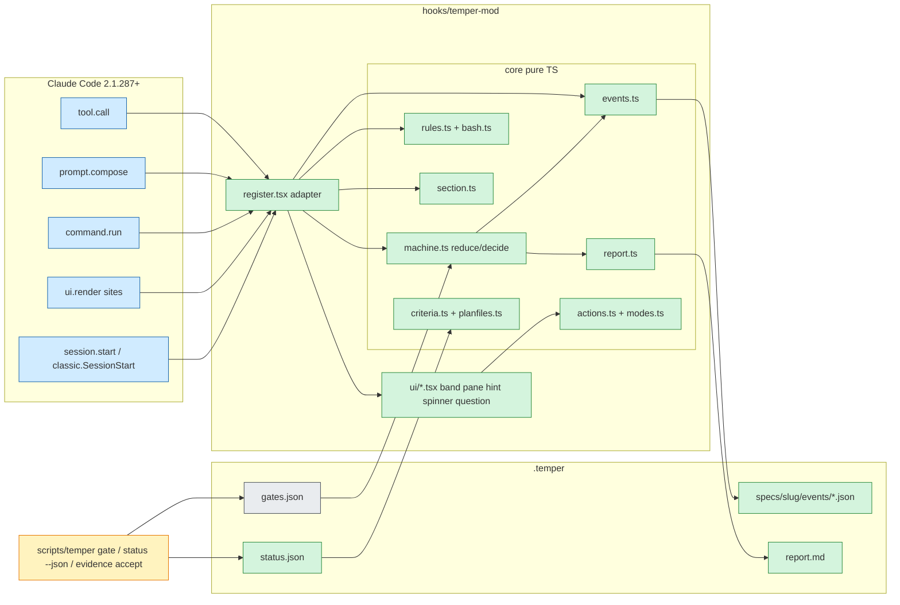

# Plan: Claude Code mods support for Temper

**Spec:** `.temper/specs/mods-support/` (intent accepted 2026-10-03, 16 criteria AC-01..AC-16)
**Design source:** `docs/mods-plan.md` sections 2 to 7 (approved: "implement according to
the docs in the repo", galando, 2026-10-03). This plan does not re-open that design; it
maps it to files, scenarios, blast radius and build order.
**Complexity:** complex (recorded in state) · **Risk Level:** MEDIUM (see end)

## Architecture

Three layers, each testable without the one above it:

1. **CLI additions (`scripts/temper`, `scripts/acceptance.py`)** — the deterministic
   spine stays the only place verdicts are computed. New: `check.commands.{test,lint,typecheck}`
   and `fix.max-loops` config keys; `temper evidence accept --stage review --id N --reason`;
   two `gate_intent` requirements ("out of scope stated", "open questions resolved");
   `temper status --json` plus `.temper/status.json` written after every `temper gate`.
   These help users without mods too.
2. **Pure core (`hooks/temper-mod/core/*.ts`, no `claude-code` import)** — event-sourced
   phase machine (`machine.ts` with `reduce` / `decide`), event file codec (`events.ts`),
   deny rules (`rules.ts`), Bash classifier (`bash.ts`), criteria parser mirroring
   `acceptance.py` (`criteria.ts`), plan file list (`planfiles.ts`), report renderer
   (`report.ts`), config reader (`config.ts`), system-prompt section text (`section.ts`),
   per-phase action table from mods-plan 3.7 (`actions.ts`), and the uiMode visibility
   matrix from 3.8 (`modes.ts`).
3. **Adapter (`hooks/temper-mod/register.tsx`) and UI (`hooks/temper-mod/ui/*.tsx`)** —
   wiring only: version guard, state rebuild on `session.start` and
   `classic.SessionStart`, `tool.call` deny, `prompt.compose` section, `command.run`
   reserved words, `turn.complete` line, toasts, `prompt.suggest`, render sites
   (`AbovePrompt` band, `Pane`, `PromptHint`, `Spinner`, `AskUserQuestion`), optional
   `turn.step` / `agent.spawn` (AC-15), `attribution.text` for PRs.

**State:** append-only event files in `.temper/specs/{slug}/events/{ts}-{session}-{seq}.json`
(one decision each, never rewritten); verdicts read only from `.temper/gates.json` and
`.temper/status.json`; folded state in `$.state`; "asked first-run" and own-event ids in
`$.store`; `uiMode` / `enforcement` / `fixMaxLoops` / `prAttribution` / `phaseModels` /
`reviewerModel` as plain-string `userConfig` (no `options`, so 2.1.200 and 2.1.259 still load).

**Phases:** Intent → Plan (with Design as sub step) → Build → Review → Check → Done, and
Fix entered on Check FAIL (and as `/temper:fix`'s entry). Commit is allowed at Done.

**Deny rules (mods-plan 3.4), the table `rules.ts` encodes:**

| Phase | Allowed Write / Edit / NotebookEdit | Other |
|---|---|---|
| Intent | spec `intent.md` | |
| Plan | `intent.md`, `plan.md`, `tasks.md`, `design.md`, new `docs/decisions/*.md` | |
| Build | plan files, sibling tests, spec dir | else scope drift choice |
| Review | spec dir (plus a file under an active Fix-finding action) | |
| Check | spec dir | test runs allowed |
| Fix | plan files, tests, spec dir | else scope drift choice |
| any before Done/override | | Bash `git commit` denied |
| any | | events dir, `gates.json`, `status.json`, `overrides.json` writes denied; decision CLI calls need a matching human event |

**Security surface (AC-13):** `calls:` limited to `command.register, config.list,
config.set, fs.exists, fs.list, fs.read, fs.stat, fs.write, prompt.submit,
prompt.suggest, session.version, state.get, state.set, store.get, store.set, ui.ask,
ui.close, ui.open, ui.resolve, ui.status, ui.toast, ui.invalidate`. No `process.*`,
`http.*`, `env.*`; asserted in CI by `scripts/check-mod-calls.sh`.

### Context sources re-read by Plan

- `docs/mods-plan.md` — read in full; sections 2 to 7 are the design used here.
- Docs `plugins/mods/reference` and `plugins/mods/test` re-fetched 2026-10-03. Confirmed:
  `modules` array in `hooks/hooks.json`; `types` in manifest names `types/index.d.ts`;
  tests are any `*.test.ts(x)` under the plugin dir; `tier('prepend')` and inline
  `plugins` for composition tests; `classic.SessionStart` with `source: 'clear'` for the
  `/clear` test; `$.fs.write` not atomic (confirms the one-file-per-event choice);
  a single test has a 5 s limit; `claude plugin validate --json` reports calls.
- **Gap:** the generated types `.claude-plugin/types/claude-code/index.d.ts` named in
  Context Sources are not in this checkout (the probe container's copy is gone). No
  decision hides behind it: Task 0 regenerates them on Claude Code 2.1.288 by loading
  the mod with `--plugin-dir`, and Build checks every event and prop name against that
  file before writing an adapter hook. No Open Question added.
- Probe results (2.1.200 / 2.1.259 / 2.1.286 / 2.1.287) are reused from mods-plan 2.1;
  re-run as the manual matrix in `docs/mods-testing.md` (AC-12).

## Approach Decisions

### Decision 1: Inject with `prompt.compose`, not `prompt.section` or `prompt.context`

- **Alternative:** `prompt.context` (first user message) or `prompt.section` (rewrite an existing section).
- **Pros:** `prompt.context` is the documented "add context" path.
- **Cons:** `prompt.section` cannot add a new section; `prompt.context` sits in the
  first message, so every phase change spends the whole prompt cache, and it is not
  re-rendered per request.
- **Why not chosen:** AC-03 needs the section present after `/compact`; a `session`-scope
  section appended last by `prompt.compose` is rendered on every request (survives
  compaction by construction) and a change only invalidates cache after it.

### Decision 2: One JSON file per decision event, not a single state file or `$.store`

- **Alternative:** one `.temper/run-state.json` rewritten on each change, or `$.store`.
- **Pros:** one read, simpler fold.
- **Cons:** `$.fs.write` is not atomic (docs), so a torn rewrite loses the whole
  history; `$.store` is machine-wide, not per project, and not committed with the spec.
- **Why not chosen:** the audit trail (AC-11) must survive sessions and machines and
  be committed with `.temper/specs/`; unique file names mean two sessions never
  overwrite each other and a torn write costs one event, which the reader skips and reports.

### Decision 3: `userConfig` fields as plain strings validated in code, not `options` pickers

- **Alternative:** declare `uiMode` / `enforcement` with `options` for a `/config` picker.
- **Pros:** nicer `/config` UI.
- **Cons:** the probe showed 2.1.200 and 2.1.259 refuse to load the whole plugin
  (`Unrecognized key: "options"`), losing commands and classic hooks.
- **Why not chosen:** AC-12 requires existing installs on old versions keep working.

### Decision 4: Tests, lint and git run as prompts to Claude, not `$.process.run`

- **Alternative:** the mod runs `scripts/temper gate check` itself via `$.process`.
- **Pros:** faster, no turn spent.
- **Cons:** adds `process.run` to the `calls:` line admins vet, bypasses Claude's
  permission prompts, and needs a timeout path.
- **Why not chosen:** AC-13 pins the API surface; actions submit a prompt and the
  verdict arrives through `gates.json` / `status.json`, which the CLI already owns.

### Decision 5: `fix.max-loops` as its own key (default 3), not reusing `loops.max-per-type`

- **Alternative:** raise `loops.max-per-type` to 3.
- **Pros:** no new key.
- **Cons:** changes the circuit breaker for every loop pair (Review→Build too) in every
  existing install, and existing `test-temper.sh` cases assert 2.
- **Why not chosen:** AC-10 names Check→Fix only; a separate key leaves 9.4.0 behavior
  untouched when absent from the CLI's point of view (CLI applies it to the check→fix
  pair only when set; the mod applies default 3).

## Diagram



## Cross-Repo Search

- not available: no cross-repo code search tool (Sourcegraph or similar MCP) is connected in this session; blast radius below comes from local grep/read of this repo only. Temper has no known downstream code consumers outside this repo — users consume it as a plugin through `plugin.json`, `hooks/hooks.json`, the `scripts/temper` CLI and `.claude/temper.config`, all covered below.

## Blast Radius

```
BLAST RADIUS — mods-support
  Direct impact:    scripts/temper (modify) → used by commands/*.md, agents/*.md, reference/*.md,
                    scripts/hooks/{verify-stage-gate,block-uncommitted-gate,stage-marker}.sh,
                    scripts/hooks/install.sh (pre-commit), scripts/tests/test-temper.sh (1590 lines)
                    [HEURISTIC]
  Direct impact:    .claude-plugin/plugin.json (modify) → read by scripts/validate-plugin.sh,
                    scripts/quality-check.sh, scripts/version-bump.sh, scripts/pack-discover.py,
                    scripts/tests/test-temper.sh, .github/workflows/release-bump.yml, release.yml,
                    claude plugin validate --strict (quality.yml) [HEURISTIC]
  Direct impact:    hooks/hooks.json (modify) → scripts/validate-plugin.sh:210-234 (iterates only
                    the "hooks" key, so "modules" is ignored, safe); Claude Code loader [HEURISTIC]
  Transitive:       gate_intent() → every /temper run and /temper:intent; test-temper.sh setup()
                    and good_draft() fixtures have no "Out of scope:" line → would FAIL [HEURISTIC]
  Transitive:       review finding counters (scripts/temper:849-869, 1362-1372) → gate_review,
                    gate_commit must skip accepted findings exactly like resolved ones [HEURISTIC]
  Risk areas:       scripts/validate-readme.sh caps README at 300 lines (now 146) and requires
                    "Install" and "How It Works" headings — the rewrite must keep both
  Risk areas:       scripts/validate-docs.sh checks every relative link under docs/ resolves —
                    docs/mods-testing.md and docs/demo-script.md links must resolve
  Risk areas:       scripts/validate-panels.py reads agents/*.md return panels — the marker
                    preamble line must sit outside the panel block
  Architectural compliance: [ok] gate logic stays in scripts/temper; [ok] mod reads verdicts only;
                    [ok] hooks fail open except the one detected violation (inert on any error);
                    [warn] no new slash command file, so plugin.json "commands" is unchanged —
                    /temper subcommands live in the adapter and in commands/temper.md prose
```

**Security hot paths:**

| File | Level | Entry point | Exposure |
|---|---|---|---|
| `hooks/temper-mod/core/rules.ts` | HIGH (permission) | `tool.call` hook (Claude's own tool calls, incl. subagents) | INTERNAL |
| `hooks/temper-mod/core/bash.ts` | HIGH (validate) | `tool.call` for `Bash` | INTERNAL |
| `hooks/temper-mod/core/events.ts` + forgery guard in `register.tsx` | HIGH (permission: who may approve) | `tool.call` writes to events dir; `command.run` origin check | INTERNAL |
| `scripts/temper` `evidence accept` / `override` | HIGH (validate) | CLI via Bash | INTERNAL |

0 CRITICAL, 4 HIGH. Each HIGH has its own scenario ("Each phase allows exactly its own
paths", "git commit is refused until Check passes", "Claude cannot forge an approval",
"temper evidence accept stops the review gate counting a finding"). Bash coverage is
best effort; the native pre-commit hook stays as the second layer; MCP file tools are
not covered (README "Where enforcement works" says so).

### Files to Create

| File | Traced to |
|---|---|
| `hooks/temper-mod/register.tsx` | Scenario: "Plan phase refuses a source write with the next action", "Every request carries the Temper section…", "On an unsupported Claude Code version the mod stays inert" |
| `hooks/temper-mod/core/machine.ts` | Scenario: "Going back to Plan invalidates every later phase", "Skipping forward over an invalidated phase is refused", "The fix loop stops at the configured limit" |
| `hooks/temper-mod/core/events.ts` | Scenario: "A torn event file is skipped and reported", "Claude cannot forge an approval" |
| `hooks/temper-mod/core/rules.ts` | Scenario: "Each phase allows exactly its own paths…", "Subagent tool calls are held to the same phase rules" |
| `hooks/temper-mod/core/bash.ts` | Scenario: "git commit is refused until Check passes, then allowed", "Claude cannot forge an approval" |
| `hooks/temper-mod/core/criteria.ts` | Scenario: "Every request carries the Temper section…" (criteria line) |
| `hooks/temper-mod/core/planfiles.ts` | Scenario: "Scope drift offers three choices and logs each decision" |
| `hooks/temper-mod/core/report.ts` | Scenario: "Completion writes the audit report" |
| `hooks/temper-mod/core/config.ts` | Scenario: "The fix loop stops at the configured limit" |
| `hooks/temper-mod/core/section.ts` | Scenario: "Every request carries the Temper section and it survives compaction" |
| `hooks/temper-mod/core/actions.ts` | Scenario: "Full mode draws every Temper element…" (hotkeys 1, 2, 3, 9, 0) |
| `hooks/temper-mod/core/modes.ts` | Scenario: "Minimal mode shows phases only and off mode draws nothing" |
| `hooks/temper-mod/ui/band.tsx` | Scenario: "Full mode…", "Minimal mode…", "Scope drift…" |
| `hooks/temper-mod/ui/pane.tsx` | Scenario: "Full mode…", "A feature description after /temper…" (bare /temper toggles) |
| `hooks/temper-mod/ui/hint.tsx` | Scenario: "Full mode…" (terminal tail, desktop pass-through) |
| `hooks/temper-mod/ui/spinner.tsx` | Scenario: "Full mode…" (spinner word) |
| `hooks/temper-mod/ui/question.tsx` | Scenario: "Full mode…" (AskUserQuestion header) |
| `types/index.d.ts` | Infrastructure: required by register.tsx `$.state` contract (manifest `types`) |
| `tests/mod/machine.test.ts` | Scenario: "Going back to Plan…", "Skipping forward…", "The fix loop stops…" |
| `tests/mod/events.test.ts` | Scenario: "A torn event file is skipped and reported" |
| `tests/mod/rules.test.ts` | Scenario: "Each phase allows exactly its own paths…" |
| `tests/mod/bash.test.ts` | Scenario: "git commit is refused…", "Claude cannot forge an approval" |
| `tests/mod/criteria.test.ts` | Scenario: "Every request carries the Temper section…" (parses templates/intent.md and this spec) |
| `tests/mod/planfiles.test.ts` | Scenario: "Scope drift offers three choices…" |
| `tests/mod/report.test.ts` | Scenario: "Completion writes the audit report" |
| `tests/mod/enforcement.test.ts` | Scenario: "Plan phase refuses a source write…", "Subagent tool calls…", "Claude cannot forge an approval", "git commit is refused…" |
| `tests/mod/compose.test.ts` | Scenario: "Every request carries the Temper section…", "State comes back after /clear…" |
| `tests/mod/commands.test.ts` | Scenario: "Override with a reason…", "Override without a reason…", "A feature description after /temper…" |
| `tests/mod/drift.test.ts` | Scenario: "Scope drift offers three choices and logs each decision" |
| `tests/mod/modes.test.ts` | Scenario: "Mode switch takes effect without restart…", "A locked mode row is reported, not changed" |
| `tests/mod/ui.test.tsx` | Scenario: "Full mode…", "Minimal mode…" (terminal, desktop, smoke on vscode/mobile) |
| `tests/mod/composition.test.ts` | Scenario: "Temper's denials compose with a prepended managed guard" |
| `tests/mod/version.test.ts` | Scenario: "On an unsupported Claude Code version the mod stays inert" |
| `tests/mod/optional.test.ts` | Scenario: "Per-phase model and reviewer model are off by default" |
| `tests/mod/fixtures/` (intent.md, plan.md, tasks.md, gates.json, status.json, events/) | Infrastructure: required by tests/mod/*.test.ts |
| `scripts/check-mod-calls.sh` | Scenario: "The mod uses no process, http or env call" |
| `docs/mods-testing.md` | Scenario: "The maintainer tests the branch on their laptop…", "Old Claude Code versions load the plugin as today" |
| `docs/demo-script.md` | Scenario: "README explains Temper at a glance…" (walkthrough video script) |
| `demo/password-reset/` (README.md, package.json, src/reset.js, src/reset.test.js, .claude/temper.config) | Infrastructure: required by docs/mods-testing.md step 5 and demo/temper.tape |
| `demo/temper.tape` | Scenario: "README explains Temper at a glance…" (hero GIF source) |
| `images/temper-hero.gif`, `images/mode-full-dark.png`, `images/mode-minimal-light.png` | Scenario: "README explains Temper at a glance…" |

### Files to Modify

| File | Change | Traced to |
|---|---|---|
| `scripts/temper` | `fix.max-loops` (check→fix pair), `evidence accept`, accepted findings skipped by review counters, two `gate_intent` requirements, `status --json` subcommand, write `.temper/status.json` after each `gate`, `--help` text | Scenario: "temper evidence accept…", "temper status --json…", "Intent gate requires an out-of-scope line…", "Check uses configured commands…" |
| `scripts/acceptance.py` | `status` mode emitting per-criterion JSON (reuses `parse_criteria` / `supported_pass`) | Scenario: "temper status --json writes per-criterion status after each gate" |
| `scripts/tests/test-temper.sh` | cases for each CLI addition; add `Out of scope:` line to `setup()` and `good_draft()` fixtures | Infrastructure: required by scripts/temper changes |
| `templates/temper.config.default` | `check.commands.{test,lint,typecheck}` (commented), `fix.max-loops: 3` | Scenario: "Check uses configured commands…" |
| `reference/check.md` | use `check.commands.*` when set before stack auto-detect | Scenario: "Check uses configured commands…" |
| `reference/fix.md` | loop limit from `fix.max-loops`, the three offers at the limit | Scenario: "The fix loop stops at the configured limit" |
| `reference/review.md` | `temper evidence accept` with reason | Scenario: "temper evidence accept…" |
| `reference/status.md`, `commands/status.md` | `temper status --json` / `.temper/status.json` | Scenario: "temper status --json…" |
| `commands/temper.md` | marker rule; prose handling of reserved subcommands (status, back, override, approve, accept, mode, pane, …) via the CLI when mods are absent | Scenario: "Without the marker the skills announce prompt-based phases" |
| `skills/temper-core/SKILL.md` | marker rule | Scenario: "Without the marker…" |
| `agents/{intent,plan,design,build,review,check,rca,fix}.md` | one-line marker rule in the preamble, outside the return panel | Scenario: "Without the marker…" |
| `hooks/hooks.json` | `"modules": ["./temper-mod/register.tsx"]` next to unchanged `hooks` | Scenario: "Old Claude Code versions load the plugin as today" |
| `.claude-plugin/plugin.json` | `userConfig` (uiMode, enforcement, fixMaxLoops, prAttribution, phaseModels, reviewerModel — plain strings, no `options`), `types`, version 9.5.0 | Scenario: "Old Claude Code versions…", "Mode switch…" |
| `scripts/validate-plugin.sh` | assert every `modules` path exists and no `userConfig` field has `options` | Scenario: "Old Claude Code versions load the plugin as today" |
| `.github/workflows/quality.yml` | job: install Claude Code ≥2.1.287, `claude plugin test .`, `scripts/check-mod-calls.sh` | Scenario: "The mod uses no process, http or env call" |
| `.gitignore` | ignore `.claude-plugin/types/` (version-specific generated types) | Infrastructure: required by Task 0 |
| `README.md` | rewrite: value line, badges, hero GIF, mermaid, mode screenshots, `<details>` action references, "Where enforcement works"; keep Install + How It Works, ≤300 lines | Scenario: "README explains Temper at a glance and still validates" |
| `docs/commands.md` | `/temper` reserved subcommands | Infrastructure: required by validate-docs.sh and README links |
| `CHANGELOG.md`, `.claude/CLAUDE.md`, `commands/temper.md` header, version stamps | 9.5.0 via `scripts/version-bump.sh` | Infrastructure: required by validate-plugin.sh version agreement |

## Patterns to Follow

- CLI subcommands: `cmd_evidence_resolve` (scripts/temper:640) is the shape for `evidence accept`; `_req` rows for new `gate_intent` checks; `_cfg_get key default` for config reads.
- `test-temper.sh`: `setup()` + `assert_eq` / `assert_exit`; one case per behavior.
- Mod tests: kit rules from the docs — register stubs before the first `$` call; fire `session.start` explicitly; `tier('prepend')` + inline `plugins` for composition.
- Hooks fail open: any thrown error in an adapter hook returns `next(e)` (`.catch` handler), except the detected-violation deny.

## Dependencies

- Claude Code ≥ 2.1.287 for the mod (2.1.288 installed here); older versions get the plugin without the mod.
- `npx @anthropic-ai/claude-code@2.1.259` / `@2.1.200` for the manual old-version matrix.
- VHS + ttyd (built from Go source) for `demo/temper.tape`; not used in CI.
- No npm dependencies: `.tsx` is loaded by Claude Code directly; `claude-code` and `claude-code/testing` are resolved by the engine.

## Risk Level: MEDIUM

Additive (old installs inert, gates unchanged), but touches the commit-gate path
(`evidence accept`, review counters) and adds `gate_intent` requirements that change
verdicts for intents lacking an `Out of scope:` line — fixtures and the CHANGELOG must
say so. Rollback: remove the `modules` key from `hooks/hooks.json`; the CLI additions
are independent and backward compatible when their config keys are absent.
