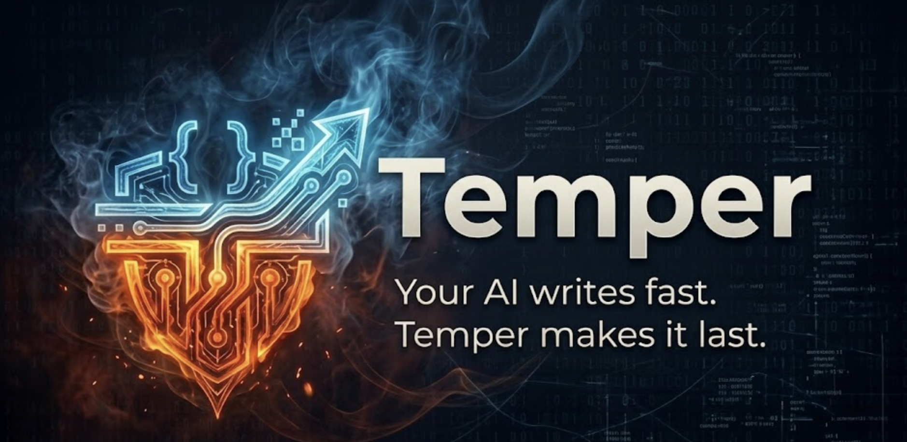

<div align="center">

# Temper

**Your AI writes fast. Temper makes it last.**

*Quality gates, blast radius analysis, and adaptive learning for AI-generated code*



[](https://github.com/galando/temper/releases)
[](https://opensource.org/licenses/MIT)
[](https://claude.ai/claude-code)
[](https://deepwiki.com/galando/temper)

[Website](https://galando.github.io/temper) • [Why Temper?](docs/why-temper.md) • [Releases](https://github.com/galando/temper/releases)

---

</div>

## The Problem

AI writes code fast. Really fast. But speed without discipline creates bugs, technical debt, and subtle issues that slip through review. You've probably seen it: hallucinated APIs, over-engineered abstractions, missing error handling, code that works in isolation but breaks integration.

## Before & After

**Before Temper:** You add user authentication. AI generates code. Tests pass. You deploy. Users report password resets don't work. The queue consumer crashed silently at 2 AM. You debug for hours.

**After Temper:**

```
/temper:plan "add password reset"     # Maps blast radius, identifies dependencies
/temper:build                         # TDD gates: tests first, then implement
/temper:review                        # Catches N+1 queries, missing rate limiting
/temper:status                        # Tracks hotspots, suggests improvements
```

The queue consumer issue? Temper's blast radius analysis flagged the async dependency. The N+1 query? Caught in review. The missing rate limiting? Flagged as HIGH confidence. You ship with confidence.

## How It Works

```
┌─────────────────────────────────────────────────────────────────────────┐
│                        AI Coding Session                                 │
├─────────────────────────────────────────────────────────────────────────┤
│                                                                          │
│  You type ───────► Temper Commands ───────► AI Instructions             │
│                                                │                         │
│                      ┌─────────────────────────┴────────────────┐       │
│                      │                                          │       │
│                      ▼                                          ▼       │
│               ┌─────────────┐                            ┌──────────┐   │
│               │   PHASE 1   │                            │  PHASE 2 │   │
│               │ Blast Radius │───────┬─────────────────► │ Quality  │   │
│               │   Analysis   │       │                   │  Gates   │   │
│               └─────────────┘       │                   └──────────┘   │
│                      │              │                         │         │
│                      │   Impact     │   Validation           │   Test   │
│                      │   Map        │   Rules                │   Gates  │
│                      │              │                         │         │
│                      └──────────────┴─────────────────────────┘         │
│                                     │                                    │
│                                     ▼                                    │
│                    ┌────────────────────────────────┐                    │
│                    │   Production-Grade Code Output  │                   │
│                    │   • Tests pass                  │                   │
│                    │   • Quality gates satisfied     │                   │
│                    │   • Impact understood           │                   │
│                    │   • Learns from patterns        │                   │
│                    └────────────────────────────────┘                    │
└─────────────────────────────────────────────────────────────────────────┘
```

**Phase 1: Blast Radius Analysis** — Maps every file that will be affected, identifies dependencies and risk areas.

**Phase 2: Quality Gates** — Enforces validation rules. Tests must pass, linting must be clean, coverage thresholds must be met.

## Comparison

| | **AI Solo** | **AI + Temper** | **Traditional Review** |
|---|-------------|-----------------|------------------------|
| Blast radius analysis | ❌ | ✅ Maps files, dependencies | Manual (error-prone) |
| Test-first enforcement | Hope AI remembers | ✅ RED-GREEN-REFACTOR gates | Code review comments |
| Performance patterns | Maybe | ✅ N+1, unbounded results, sync I/O | Manual inspection |
| Confidence scoring | All equal | ✅ Filters by threshold | Reviewer judgment |
| False positive handling | ❌ | ✅ Review memory suppresses noise | Reviewer fatigue |
| AI-specific patterns | ❌ | ✅ Hallucinated APIs, over-engineering | ❌ |
| Learning over time | ❌ | ✅ Pattern detection, rule suggestions | ❌ |
| Context footprint | N/A | ~2KB always-on | Human reviewer time |

## Value by Audience

### Solo Developers
- **Confidence** that AI-generated code actually works
- **Time back** from manual review and debugging
- **Learning** that adapts to your codebase patterns

### Teams
- **Shared standards** enforced automatically via custom packs
- **Consistent quality** regardless of who wrote the prompt
- **Hotspot tracking** to identify files needing attention

### Organizations
- **Audit trail** — every plan, review, and fix is logged
- **Compliance** — BLOCK rules enforce organizational standards
- **Metrics** — coverage trends, issue density, learning progress
- **Debt tracking** — know where technical debt accumulates

## Commands

| Command | Purpose |
|---------|---------|
| [`/temper:plan`](docs/commands.md#temperplan) | Plan with blast radius analysis |
| [`/temper:build`](docs/commands.md#temperbuild) | Build with TDD + quality gates |
| [`/temper:review`](docs/commands.md#temperreview) | Code review with confidence scoring |
| [`/temper:check`](docs/commands.md#tempercheck) | Stack validation (auto-detects) |
| [`/temper:fix`](docs/commands.md#temperfix) | Root cause analysis + fix |
| [`/temper:standards`](docs/commands.md#temperstandards) | Build team standards |
| [`/temper:status`](docs/commands.md#temperstatus) | Quality metrics dashboard |

## Quality Packs

Packs are collections of rules enforced during code generation and review:

| Severity | Behavior |
|----------|----------|
| **BLOCK** | Stops progress until issue is fixed |
| **WARN** | Flags issue, requires acknowledgment |
| **SUGGEST** | Informational, logged only |

### Built-in Packs

| Pack | Severity | What it enforces |
|------|----------|-----------------|
| `quality` | BLOCK | Method length, DRY, naming, complexity |
| `tdd` | WARN | RED-GREEN-REFACTOR, coverage |
| `security` | BLOCK | OWASP Top 10, no secrets in code |
| `git` | SUGGEST | Conventional commits, branching |

### Custom Packs

Add a `rules.md` file and Temper discovers it automatically:

```markdown
# .claude/packs/my-company/rules.md

## BLOCK
- All API responses use DTOs
- No raw SQL queries

## WARN
- Constructor injection only
- Max method length: 20 lines
```

Run `/temper:standards` to create packs interactively.

## Installation

### Claude Code

```bash
/plugin marketplace add galando/temper
/plugin install temper
```

### Use It

```bash
cd your-project
/temper:check           # Auto-detects your stack
/temper:plan "feature"  # Plan with blast radius
/temper:build           # Build with TDD gates
/temper:review          # Review with confidence scoring
```

## Adaptive Learning

Temper gets smarter the more you use it:

- **Pattern Detection** — Identifies recurring issues in your code
- **Rule Suggestions** — Proposes rules based on review history
- **Noise Reduction** — Suppresses false positives over time
- **Hotspot Tracking** — Shows which files generate the most issues

## Documentation

- [Why Temper?](docs/why-temper.md) — Why "be careful" isn't enough
- [Commands Reference](docs/commands.md) — Full command documentation
- [Getting Started](docs/getting-started.md) — Step-by-step guide
- [Packs](docs/packs.md) — Built-in and custom packs
- [Enterprise Setup](docs/enterprise.md) — Deploy across your organization

## Supported Stacks

| Stack | Detection | Auto-Commands |
|-------|-----------|---------------|
| Spring Boot | `pom.xml` / `build.gradle` | `mvn compile`, `mvn test` |
| React + TS | `package.json` + `tsconfig.json` | `npm test`, `npm run build` |
| Node/Express | `package.json` + express | `npm test`, `npm run lint` |
| FastAPI | `pyproject.toml` + fastapi | `pytest`, `ruff check` |
| Go | `go.mod` | `go test`, `golangci-lint` |
| Rust | `Cargo.toml` | `cargo test`, `cargo clippy` |

## Contributing

We love contributions! See [CONTRIBUTING.md](CONTRIBUTING.md) for guidelines.

## License

MIT © [Gal Naor](https://github.com/galando)

---

<div align="center">

**[Back to Top](#temper)**

Made with care for the AI coding community

</div>
