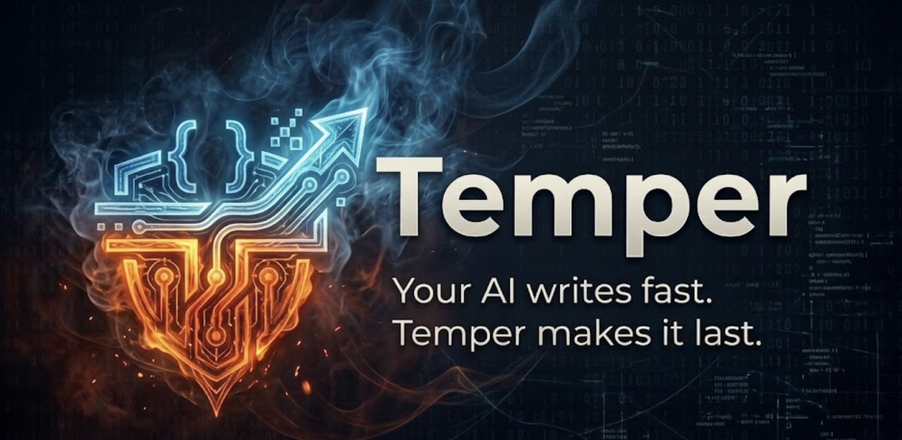

<div align="center">

# Temper

**Your AI writes fast. Temper makes it last.**

*Intent-driven development with behavioral testing, security analysis, and quality gates for AI-generated code*



[](https://github.com/galando/temper/releases)
[](https://opensource.org/licenses/MIT)
[](https://claude.ai/claude-code)
[](https://deepwiki.com/galando/temper)
[](https://repoxplain.nl/repo/galando/temper?ref=badge)

[Website](https://galando.github.io/temper) | [Getting Started](docs/getting-started.md) | [Releases](https://github.com/galando/temper/releases)

---

</div>

## The Problem

AI writes code fast. But "fast" without "right" creates bugs, technical debt, and features that miss the point.

> "Why not just tell Claude to be careful?"

You can. And it helps. But AI-generated code has **structural failure patterns** that "be careful" doesn't address. These aren't sloppiness — they're limitations of how LLMs generate code:

- **Missing behaviors** — AI builds the happy path, skips edge cases. Rate limiting? Error recovery? Never implemented.
- **Wrong problem solved** — Feature works perfectly, but nobody asked for it. All tests pass, wrong thing built.
- **Over-engineering** — AI creates factories, strategies, and abstractions for something used exactly once.
- **Hallucinated APIs** — AI calls methods that don't exist. It's confident they do.
- **Missing wiring** — New code never registered in routing, DI, or config. The code itself is correct; the integration is missing.

These map to three unanswered questions:

| Question | What Goes Wrong Without It |
|----------|---------------------------|
| **Did we solve the problem?** | Feature works but nobody uses it. Wrong problem solved. |
| **Does it do the right things?** | Happy path works, edge cases ship broken. |
| **Does the code work?** | Tests pass, but they test implementation details, not behaviors. |

Most AI tools answer only the third. Temper answers all three.

---

## IDD + BDD + TDD: Three Layers, One File

Temper combines three development methodologies in a single artifact called `intent.md`. Each layer answers a different question and is enforced at a different stage of the pipeline:

```
intent.md
|
+-- Intent Section (IDD)        WHY are we building this?
|   |                            Problem statement
|   |                            Success criteria (each with a Validate: type)
|   |                            Constraints
|   |
+-- Scenarios Section (BDD)     WHAT should it do?
    |                            Gherkin Given/When/Then
    |                            Derived BEFORE architecture
    |                            Every planned file traces to a scenario
    |
    +-- /temper:build (TDD)      HOW do we build it?
                                 Tests written from scenarios
                                 RED -> GREEN -> REFACTOR
```

---

### IDD: Intent-Driven Development

**Question:** Did we solve the problem?
**When:** Defined during `/temper:plan`, validated during `/temper:review`

IDD captures the *why* behind a feature. Not "add a password reset endpoint" but "users should be able to reset their password without contacting support, completing the flow in under 2 minutes."

The Intent section of `intent.md` contains:

- **Problem** — What problem are we solving? For whom?
- **Success Criteria** — Measurable outcomes, each with a **`Validate:` type** that tells review *how* to check it
- **Constraints** — Technical or business limitations
- **Target Users** — Who benefits

#### Validate Types

Each success criterion gets a validation type. This is what makes IDD mechanical instead of subjective:

| Type | What It Means | How Review Checks It | Example |
|------|--------------|---------------------|---------|
| `scenario` | Criterion is satisfied when a linked BDD scenario's test passes | Finds the test, runs it, checks PASS | "Users can reset password" -> linked to scenario "Successful password reset" |
| `code` | Criterion is satisfied when specific code exists | Greps the codebase for the pattern | "POST /api/reset endpoint exists" -> greps for route definition |
| `metric` | Can't be verified before deployment | Flags for post-deploy monitoring | "Support tickets decrease 30%" -> requires production data |
| `manual` | Requires human judgment | Flags for human review, non-blocking | "Reset flow feels intuitive" -> UX review needed |

**Why this matters:** Without validate types, "intent validation" means the AI reads your success criteria and subjectively judges "yeah, this looks met." With validate types, most criteria are mechanically verified — a test passes or it doesn't, code exists or it doesn't. Only `metric` and `manual` require judgment.

#### Intent Validation in Review

When `/temper:review` runs, it produces:

```
Intent Validation (IDD): 4/5 (3 mechanical, 1 deferred, 1 manual)
  Problem: Users unable to reset passwords without support

  [x] Users can reset password without support
      validate: scenario -> test_successful_reset PASS
  [x] Reset endpoint exists at POST /api/reset
      validate: code -> route found in AuthController.ts:23
  [x] Rate limiting prevents abuse
      validate: scenario -> test_rate_limiting PASS
  [ ] Support ticket volume decreases 30%
      validate: metric -> post-deploy monitoring required
  [ ] Reset flow completes in under 2 minutes
      validate: manual -> requires human review

  Confidence: 3/5 mechanically verified
```

The higher the ratio of `scenario`/`code` criteria, the more confidence you have that the feature actually solves the stated problem.

---

### BDD: Behavior-Driven Development

**Question:** Does it do the right things?
**When:** Scenarios derived during `/temper:plan` (before architecture), enforced during `/temper:build`

BDD in Temper isn't an afterthought — **scenarios are derived before the architecture exists.** This is the key design decision. The flow is:

```
1. Blast radius analysis     -> identifies affected files and risk areas
2. Scenario derivation       -> behaviors from requirements + blast radius
3. Architecture from scenarios -> file list justified by scenarios
```

Not the other way around. This prevents the AI from planning 15 files and then writing scenarios that justify them. Instead, scenarios define what the system must do, and the file list follows.

#### Where Scenarios Come From

Scenarios aren't invented — they're derived from concrete sources:

| Source | Becomes |
|--------|---------|
| Feature description | Happy path scenarios |
| Acceptance criteria (Jira/GitHub issue) | Validation scenarios |
| Blast radius: risk areas | Edge case and error scenarios |
| Blast radius: affected consumers | Regression guard scenarios ("existing X still works") |

#### File-to-Scenario Traceability

Every file in the plan must justify its existence:

```
Scenario-traced files:
  src/services/PasswordResetService.ts  -> Scenario: "Successful password reset"
  src/middleware/RateLimiter.ts          -> Scenario: "Rate limiting enforced"

Infrastructure files (no scenario needed, but must state dependency):
  db/migrations/001_add_reset_tokens.sql -> Required by PasswordResetService
  config/email.ts                        -> Required by PasswordResetService
```

If the AI plans a file that no scenario needs and isn't infrastructure — that file shouldn't exist. This is how Temper prevents over-engineering structurally, not by hoping the AI "keeps it simple."

#### Scenario Coverage Gate

After all tasks complete, `/temper:build` runs the scenario coverage gate:

```
Scenario Coverage: 5/5
  [x] Successful password reset     -> test_successful_reset (PASS)
  [x] Expired token rejected        -> test_expired_token (PASS)
  [x] Rate limiting enforced        -> test_rate_limiting (PASS)
  [x] Invalid email format          -> test_invalid_email (PASS)
  [x] Non-existent user handled     -> test_nonexistent_user (PASS)
```

If any scenario has no passing test, build cannot proceed. It writes the missing test, runs it, and implements the feature if the test fails. This is how the rate-limiting example works — the scenario existed in intent.md, no test covered it, so build caught the gap.

---

### TDD: Test-Driven Development

**Question:** Does the code work?
**When:** During `/temper:build`, per scenario

TDD in Temper is **scenario-driven**. Instead of the AI deciding what to test, tests are derived from BDD scenarios:

| BDD Scenario | Becomes TDD |
|-------------|-------------|
| `Given` (preconditions) | Test setup |
| `When` (action) | Method/endpoint call |
| `Then` (expected outcome) | Assertions |
| Scenario name | Test name |

The cycle per scenario:

1. **RED** — Write test mapped to scenario name. Run it. Must fail (proves the test actually tests something).
2. **GREEN** — Write minimal code to make the test pass. Nothing more.
3. **REFACTOR** — Clean up only if safe and obvious. All tests must still pass.

#### How TDD and BDD Work Together

When both `intent.md` and the TDD pack are active:

- **intent.md drives WHAT to test** — scenarios define the test cases
- **TDD pack drives HOW to test** — RED-GREEN-REFACTOR discipline, naming conventions, test structure

When only TDD pack is active (no intent.md — trivial/simple features):

- TDD pack drives both what and how — freestyle test-first development

When neither is active:

- No enforced test-first — implement, then test

This priority chain means intent.md and TDD aren't competing methodologies. They're layers.

---

### How `/temper:plan` Generates intent.md

When you run `/temper:plan "add password reset"`, here's what happens:

**Phase 1 — Blast Radius:** Scans codebase. Maps every file affected. Finds dependencies. Identifies risk areas (security-critical code, high-defect modules, shared libraries).

**Phase 2 — Derive Scenarios (before architecture):** From requirements + blast radius:

- Feature description -> "Successful password reset" (happy path)
- Risk area: token expiration -> "Expired token rejected" (error path)
- Risk area: abuse vector -> "Rate limiting enforced" (edge case)
- Affected consumer: auth flow -> "Existing login still works" (regression guard)

Each scenario gets a testing approach (`Note:` field):

- `unit` — pure logic, no external dependencies (default)
- `mock` — test with mocked external dependency
- `integration` — cross-boundary test (database, multi-service)
- `manual` — can't be automated (UX, visual, email delivery)

**Phase 3 — Architecture from Scenarios:** Builds the file list. Each file must trace to a scenario. Infrastructure files (migrations, config) trace to the files they support. Untraced files are flagged.

**Phase 4 — Generate intent.md:** Writes the contract with:

- Intent section: problem, success criteria with `Validate:` types, constraints
- Scenarios section: Gherkin scenarios with `Note:` testing approach
- Coverage checklist: populated by build after implementation

**You review and edit intent.md before approving.** Add scenarios. Remove them. Change success criteria. This is the contract between you and the AI on what "done" means.

---

## Real Findings

### Missing Edge Case

AI built password reset. All tests pass. But intent.md had:

```gherkin
Scenario: Rate limiting on reset requests
  Given a user has requested 3 resets in 10 minutes
  When they request another reset
  Then the request is rejected with 429
  Note: unit
```

Scenario coverage gate caught it: no test for rate limiting. Build wrote the test. Test failed. Build implemented rate limiting. Test passed. Without intent.md, rate limiting would never have been implemented.

### Over-Engineering Caught by Traceability

AI planned `UserValidatorFactory`, `ValidationStrategy` interface, and `ValidationChain` — for a single validation rule. File-to-scenario traceability flagged it: only one scenario needed validation, and it mapped to a single function. Three files became one.

### Wrong Problem Solved

Success criterion: "Users can reset password without contacting support." Validate: `scenario`.

AI built it correctly. But also added an admin-only reset endpoint nobody asked for. The untraced file was flagged: "Unplanned file created. Trace to scenario or mark as infrastructure."

---

## What's New in v4.4.0

v4.4.0 makes quality packs **fast and discoverable**. A cached manifest eliminates repeated filesystem scans, quick-create launcher packs wrap any plugin or skill in seconds, and all pack decisions use structured `AskUserQuestion` prompts.

### Cached Pack Manifest

Pack discovery results are cached to `.temper/pack-manifest.json` for instant subsequent loads. First run does a full 3-tier scan; subsequent runs load from cache in under 2 seconds. Cache is rebuilt automatically when `temper.config` changes, packs are added/removed, or the manifest schema version mismatches.

### Quick-Create Launcher Packs

Fast path for creating a pack that wraps an existing plugin or skill. The system discovers all linkable targets, you pick one and name the pack, and Temper generates a launcher template with BLOCK-level enforcement — guaranteeing the linked resource is always used.

### Plugin/Skill Filesystem Discovery

Automatic discovery of all linkable targets from the filesystem: installed plugins (`plugin://{name}`), project and global skills (`skill://{name}`), and command-based skills (`.claude/commands/*.md`). Deduplication ensures each name appears once.

### AskUserQuestion-Driven UX

All decision points in `/temper:pack` now use `AskUserQuestion` for structured, clickable options. Toggle packs, quick-create launchers, configure links — no more free-text guessing. Cursor IDE uses conversational numbered prompts with the same options.

### Command-Based Skill Linking

Skills defined as markdown command files (`.claude/commands/*.md`) are now valid link targets alongside traditional `SKILL.md` files. The resolution chain checks standard skills, global skills, plugin skills, then command-based fallback — ensuring any Temper-compatible resource can be linked to a pack.

---

## What's New in v4.3.0

v4.3.0 overhauls the pack system with **three-tier resolution, plugin/skill linking, phase scoping, and connection health validation**.

### Three-Tier Pack Resolution

Quality packs now resolve from three tiers in priority order:

```
Priority 1 (highest) → .claude/packs/{name}/rules.md           (project-local)
Priority 2           → ~/.claude/packs/{name}/rules.md          (global / user-wide)
Priority 3 (lowest)  → $TEMPER_ROOT/.claude/packs/{name}/rules.md  (built-in)
```

Teams ship project-specific packs in the repo, users create global packs across all projects, and built-in packs provide sensible defaults.

### Pack-Plugin/Skill Linking

Packs can link to external plugins or skills, injecting their context alongside pack rules during phase execution. When a pack loads, the linked resource's instructions are included in the AI prompt context — context injection, not code execution.

```yaml
packs:
  - name: api-standards
    link: plugin://my-api-linter     # Links to an installed plugin
  - name: sec-review
    link: skill://security-review    # Links to a skill
```

### Phase Scoping

Packs can be restricted to specific Temper phases so they only activate when relevant. A TDD pack only runs during build, a security pack only during review and check. Available phases: `plan`, `design`, `build`, `review`, `check`, `fix`.

### Connection Health Validation

When a pack has a link, the system validates that the target exists and is accessible. Plugin links check `~/.claude/plugins/installed_plugins.json`, skill links search `.claude/skills/` directories. Graceful degradation: if a link target is missing, the pack's own rules still load with a warning — a removed plugin never blocks all work.

---

## What's New in v4.2.0

v4.2.0 adds **Cursor IDE support, feedback loop gates with circuit breakers, an enhanced Design phase, and cross-walkthrough navigation**.

### Cursor IDE Support

Full Temper experience for [Cursor](https://cursor.sh) users with feature parity to the Claude Code CLI. A generation script (`scripts/generate-cursor.py`) mirrors `.claude/` to `.cursor/` — commands, skills, packs, and reference docs. IDE-specific adaptations handle the differences: hyphenated commands (`/temper-plan`), conversational stage gates instead of `AskUserQuestion`, and always-on pack context via Cursor rules.

### Feedback Loop Gates & Circuit Breaker

Explicit gates between stages allow returning to earlier stages when issues are found, with automatic circuit breakers:

```
Review ──[issues found]──→ Build    (max 2 loops)
Check  ──[tests fail]────→ Build    (max 2 loops)
Build  ──[architecture]──→ Plan     (max 1 loop)
```

After 3 loops in any direction, the "Return" option becomes "Accept with known issues." Context is passed between stages via `.temper/` JSON files (`review-context.json`, `check-context.json`, `build-context.json`).

### Design Phase (Enhanced)

An optional stage for system design on complex or medium-complexity features. Produces: system architecture, API contracts, database changes, integration points, and a decision log (ADRs). Auto-skipped when complexity is below medium or config `phases.design: false`.

### Cross-Walkthrough Navigation

Users can switch between Plan and Design walkthroughs at any point during interactive section-by-section review. Plan final gate includes "Walk through design," design final gate includes "Walk through plan." Non-linear exploration before committing to build.

---

## What's New in v4.1.0

v4.1.0 makes feedback loops **actually work**. The v4.0.0 documentation described loop types and schemas, but the orchestrator never executed them — stages always flowed linearly. Now Review and Check gates actively offer "Loop back to Build" when issues are found, with full context transfer and circuit breakers.

### Working Feedback Loops

Review finds issues or Check fails tests? The gate now shows a "Loop back to Build" option. Selecting it writes a context file (`review-context.json` or `check-context.json`) and re-launches the Build agent with the fix context — no more manually restarting the pipeline.

```
REVIEW finds 3 HIGH issues
  → Gate shows: "Loop back to Build (Fix issues)"
  → User selects → review-context.json written
  → Build agent re-enters with fix context
  → Fixes applied → back to Review
  → Circuit breaker: max 2 loops, same issue 2x = stop
```

The loop instructions reference real Claude Code tools (Read, Write, Bash) — not pseudo-code functions that don't exist at runtime. Every step is actionable.

---

## What's New in v4.0.0

v4.0.0 transforms Temper from a one-way pipeline into a **cyclic SDLC platform** with feedback loops, context accumulation, observability, and an optional Design phase. Inspired by [The Agentic SDLC](https://amoshaviv.com/blog/the-agentic-sdlc/) framework.

### Feedback Loops

Stages can now loop back to upstream stages with failure context. No more "stop and start over" when Review finds issues or Check fails tests.

| Loop | Trigger | Behavior |
|------|---------|----------|
| Review → Build | Auto-fixable issues found | Fix applied, re-review, max 2 loops |
| Check → Build | Test failures | Fix task created with failure context, max 2 loops |
| Build → Plan | Infeasible design | Plan revision with what went wrong |

Circuit breakers prevent infinite loops — same issue twice triggers human intervention.

### Context Accumulation

Each stage now produces structured artifacts that accumulate for downstream stages. No more "agent amnesia" between stages.

```
.temper/specs/{feature}/
  intent.md           ← Plan produces this
  design.md           ← Design produces this (if complex)
  build-context.json  ← Build writes deviations + test results
  review-context.json ← Review writes findings + intent verdict
  check-context.json  ← Check writes validation results
```

### Observability

Per-stage metrics tracking: tokens, latency, tool calls, and quality trends over time. Shown in `/temper:status`.

```
| Stage   | Avg Tokens | Avg Latency | Total Runs |
|---------|------------|-------------|------------|
| Plan    | ~4,200     | ~12s        | 15         |
| Build   | ~12,000    | ~45s        | 15         |
| Review  | ~8,500     | ~30s        | 15         |
| Check   | ~2,100     | ~25s        | 15         |
```

### Design Phase (Optional)

New `/temper:design` stage for complex features: system architecture, API contracts, DB schema. Automatically skipped for simple/trivial features. Enabled by default.

### All Features Enabled by Default

v4.0.0 enables all new features by default. Disable any via `.claude/temper.config`:

```yaml
phases:
  design: true         # Set false to skip Design stage
feedback:
  enabled: true        # Set false to disable feedback loops
  max-loops: 2         # Circuit breaker limit
observability:
  enabled: true        # Set false to disable metrics tracking
```

---

## What's New in v3.1.0

v3.1.0 adds **proven verification** — live test execution and MCP-powered analysis that replaces heuristic opinions with mechanically verified findings. Zero breaking changes: everything works as v3.0.0 when no MCP servers are installed.

### Live Scenario Verification

Every Gherkin scenario in intent.md can now be **executed individually** against your project's test runner. Not "Claude reads the test and judges it" — actually running it and showing real pass/fail output.

```
SCENARIO VERIFICATION RESULTS
┌──────────────────────┬───────────────────┬──────────┬──────────┐
│ Scenario             │ Test              │ Result   │ Time     │
├──────────────────────┼───────────────────┼──────────┼──────────┤
│ User resets password │ test_reset        │ ✅ PASS  │ 0.12s    │
│ Invalid email        │ test_invalid      │ ✅ PASS  │ 0.05s    │
│ Rate limiting        │ test_rate_limit   │ ❌ FAIL  │ 0.08s    │
│ Token refresh        │ —                 │ ⚠ MISSING│ —        │
└──────────────────────┴───────────────────┴──────────┴──────────┘
```

Configured via `check.live-scenarios: prompt|always|never` in temper.config. No MCP required — uses your project's existing test runner.

### MCP-Powered Analysis

When MCP servers are available, Temper upgrades grep-based heuristic analysis to tool-powered proven findings:

| Analysis | Without MCP | With MCP |
|----------|-------------|----------|
| Blast radius | grep-based `[HEURISTIC]` | code-review-graph `[PROVEN]` |
| Security scan | OWASP patterns `[HEURISTIC]` | semgrep SAST `[PROVEN]` |
| Call chain tracing | grep imports `[HEURISTIC]` | query_graph_tool `[PROVEN]` |
| Impact radius | grep consumers `[HEURISTIC]` | get_impact_radius_tool `[PROVEN]` |

### Evidence Labels

Every finding now carries a label that tells you how it was produced:

- **`[PROVEN]`** — Tool output (MCP server, test runner, SAST scan). Mechanically verified.
- **`[HEURISTIC]`** — Claude's grep-based analysis. Best-effort, not mechanically verified.
- **`[SEMANTIC]`** — Claude's interpretation or judgment. Inherently subjective.

Configured via `tools.label-findings: true` and `tools.mode: auto|heuristic-only|require` in temper.config.

### Full Pipeline for Fixes

`/temper:fix` now gets the same MCP and live verification enhancements as the main pipeline. MCP call chain tracing in RCA, proven blast radius in the fix agent, and individual regression test execution in validation.

---

## What's New in v3.0.0

v3.0.0 adds a **quality intelligence layer** to review and check — zero new dependencies, no setup required. Pure methodology improvements that make every review and check dramatically more thorough.

### Security Hot Path Detection

During planning, Temper classifies every affected file by security sensitivity (CRITICAL/HIGH/MEDIUM/LOW) and traces call chains to entry points. Code touching auth, payments, or crypto gets elevated scrutiny automatically.

```
SECURITY IMPACT:
  src/services/PaymentService.ts (processRefund) → CRITICAL
    Reachable from: POST /api/refunds (AUTHENTICATED)
    Risk: Missing authorization check — user could refund any payment
    Recommendation: Add scenario "User can only refund own payments"
```

### Diff-Aware Review

Instead of reading entire files, Temper builds a **diff fingerprint** that classifies each changed region by risk level. High-risk hunks (security keywords, DB mutations, error handling, concurrency) get 80% of review attention. Low-risk changes (config, imports) get standard review.

### Cross-File Pattern Consistency

Temper detects when a changed file introduces a pattern that contradicts the codebase's established patterns. New file uses `try/catch` but all peers use `Result<>`? Flagged as inconsistency.

```
⚠️  PaymentService uses try/catch, but 8 other services use Result<Ok, Err>
    Suggestion: Align with established pattern or document why new pattern is better
```

### Heuristic Test Gap Analysis

After tests pass, Temper reads implementation and test code side-by-side. It identifies **edge cases the tests miss** — no null test, no boundary test, no error path test. Security-critical code with no test is BLOCKED. This is static analysis (reading code), not execution-based mutation testing.

```
✅ UserService.validateEmail — STRONG (all branches covered)
⚠️  PaymentService.calculateRefund — WEAK (happy path only)
   Gaps: no test for amount=0, negative amount, null input
❌ AuthService.generateToken — NO TEST (security-critical) → BLOCKED
```

### API Diff Review

When code changes API boundaries (endpoints, DTOs, response shapes), Temper reads the git diff to detect the change, greps for consumers, and checks if they're updated. Breaking changes with unverified consumers are flagged. This is heuristic (grep-based) not runtime contract testing.

```
❌ POST /api/auth/login — BREAKING (response.token → response.access_token)
   Consumers: 2 tests ✅, 1 frontend ❌ NOT UPDATED → FLAGGED
```

### Performance Pattern Detection

Temper scans changed code for performance anti-patterns: N+1 queries (loops with DB calls), missing pagination (unbounded endpoints), sync I/O in request handlers, and inefficient data structures (Array.includes in loops). When benchmarks exist, it also compares against baseline.

```
[HIGH] N+1 query in UserController.ts:45 — forEach loop with User.findById()
[HIGH] Missing pagination in GET /api/orders — no LIMIT clause
[MEDIUM] Inefficient lookup in PermissionService.ts:78 — Array.includes() in loop
```

### Why This Matters

| Before v3.0.0 | After v3.0.0 |
|----------------|---------------|
| Review reads entire files | Review focuses on high-risk diff regions |
| Security issues found by luck | Security hot paths traced to entry points automatically |
| Tests pass but test nothing | Test gap analysis finds untested edge cases |
| API breaking changes ship silently | API diff review flags unverified breaking changes |
| Performance anti-patterns caught in prod | Pattern detection catches N+1, missing pagination before commit |
| Pattern drift accumulates silently | Cross-file consistency detects drift immediately |

---

## Commands

### Unified Command (Recommended)

```
/temper "add login feature"     # One command for the full SDLC
```

Runs plan → design? → build → review → check with **stage gates**, **feedback loops**, and **observability**. At each stage, you see a summary and choose to proceed, edit, or stop.

### Individual Commands (Granular Control)

| Command | Purpose |
|---------|---------|
| [`/temper:plan`](docs/commands.md#temperplan) | Blast radius + BDD scenarios + architecture |
| [`/temper:design`](docs/commands.md#temperdesign) | System design (complex/medium features) |
| [`/temper:build`](docs/commands.md#temperbuild) | Scenario-driven TDD + coverage gate |
| [`/temper:review`](docs/commands.md#temperreview) | Structured intent validation + confidence scoring |
| [`/temper:check`](docs/commands.md#tempercheck) | Stack validation (auto-detects) |
| [`/temper:fix`](docs/commands.md#temperfix) | Root cause analysis + regression test |
| [`/temper:pack`](docs/commands.md#temperpack) | Manage quality packs |
| [`/temper:status`](docs/commands.md#temperstatus) | Quality metrics + observability dashboard |

### Stage Gates

Each stage ends with a gate:

```
┌─────────────────────────────────────────────────────────────┐
│ PLAN COMPLETE — Add Login Feature                           │
├─────────────────────────────────────────────────────────────┤
│ INTENT                                                      │
│    Problem: Users can't access protected routes             │
│    Success: JWT auth with role-based access                 │
│    Scenarios: 5 (4 unit, 1 integration)                     │
│                                                             │
│ FILES: 3 create, 2 modify                                   │
│ RISK: Medium (touches auth layer)                           │
│ SECURITY: 2 hot paths (1 CRITICAL, 1 HIGH)                  │
│    AuthService.verifyToken → 47 endpoints affected          │
│                                                             │
│ Continue to Build (Recommended) / Walk through / Save       │
└─────────────────────────────────────────────────────────────┘
```

- **Continue** → Proceed, context clears, next stage begins
- **Walk through** → Interactive step-by-step plan walkthrough
- **Save** → Stop, save state, resume later with `/temper`
- **Other** → Type a change request, edits applied, gate re-appears

## Quality Packs

Packs are rule sets enforced during code generation and review. Three-tier resolution: project-local > global > built-in.

| Pack | Severity | What it enforces |
|------|----------|-----------------|
| `quality` | BLOCK | Method length, DRY, naming, complexity |
| `tdd` | WARN | RED-GREEN-REFACTOR, coverage |
| `security` | BLOCK | OWASP Top 10, no secrets in code |
| `git` | SUGGEST | Conventional commits, branching |

Create custom packs with `/temper:pack` or add a `rules.md` to `.claude/packs/your-pack/`. Link packs to plugins or skills for automatic context injection. Scope packs to specific phases (build, review, check) to keep prompt context focused.

## Installation

```bash
/plugin marketplace add galando/temper
/plugin install temper
```

```bash
cd your-project
/temper:plan "your feature"    # Scenarios + blast radius + architecture
/temper:build                  # Scenario-driven TDD
/temper:review                 # Structured intent validation
```

## Recommended Setup

Temper works out of the box. Two optional MCP servers upgrade grep-based heuristic analysis (`[HEURISTIC]`) to mechanically verified findings (`[PROVEN]`).

### 1. code-review-graph (Blast Radius + Call Chains)

Provides AST-level dependency graphs, call chain tracing, and impact radius analysis.

```bash
# Install
pip install code-review-graph

# Register with Claude Code
claude mcp add code-review-graph -- code-review-graph
```

**Restart Claude Code.** MCP servers are loaded at startup — changes don't take effect until restart.

**Build the graph for your project.** In your first session after install:

```
> ask Claude to call build_or_update_graph_tool for your project
```

Or it will auto-build the first time you run `/temper:plan`. The graph indexes source files (`.ts`, `.py`, `.go`, `.java`, etc.) — it reports 0 nodes on markdown-only projects (expected).

### 2. Semgrep (Security Scanning)

Provides SAST scanning for security vulnerabilities. Replaces OWASP pattern-matching with real static analysis.

```bash
# Install
brew install semgrep

# Register with Claude Code
claude mcp add semgrep -- semgrep --mcp
```

**Restart Claude Code.** Same reason as above — MCP changes require restart.

> **Supply chain scanning** (`semgrep_scan_supply_chain`) requires a running Semgrep daemon with an API token: `semgrep daemon start`. For most projects, SAST file scanning is sufficient.

### 3. Verify Everything Works

Run `/temper:status` in your project. Look for this section in the dashboard:

```
MCP TOOLS
  code-review-graph: available       ← should say "available"
  semgrep: available                 ← should say "available"
  Evidence ratio: 0% [PROVEN]
  Setup: docs/recommended-setup.md
```

**If either shows `unavailable`:**

| Symptom | Fix |
|---------|-----|
| Both show `unavailable` | You didn't restart Claude Code after `claude mcp add` |
| code-review-graph unavailable | Run `pip install code-review-graph` and restart |
| semgrep unavailable | Run `brew install semgrep` and restart |
| Available but `[HEURISTIC]` findings | Graph hasn't been built yet — run `/temper:plan` on a feature, or ask Claude to call `build_or_update_graph_tool` |
| `require` mode + unavailable | Change `tools.mode` to `auto` in temper.config, or install the missing server |

### 4. Configuration

Configure MCP behavior in `.claude/temper.config`:

```yaml
tools:
  mode: auto              # auto | heuristic-only | require
  label-findings: true    # Show [PROVEN]/[HEURISTIC]/[SEMANTIC] labels
```

| Mode | Behavior |
|------|----------|
| `auto` | Use MCP when available, fall back to heuristics (default) |
| `heuristic-only` | Never use MCP tools, always use grep-based analysis |
| `require` | Fail if MCP tools are unavailable — for teams that need proven analysis |

Full setup guide: [docs/recommended-setup.md](docs/recommended-setup.md)

## Adaptive Learning

- **Pattern Detection** — Identifies recurring issues in your code
- **Rule Suggestions** — Proposes rules based on review history
- **Noise Reduction** — Suppresses false positives over time
- **Hotspot Tracking** — Shows which files generate the most issues

## Documentation

- [Getting Started](docs/getting-started.md) — Step-by-step guide
- [Recommended Setup](docs/recommended-setup.md) — MCP servers and live verification
- [Commands Reference](docs/commands.md) — Full command documentation
- [Packs](docs/packs.md) — Built-in and custom packs
- [Enterprise Setup](docs/enterprise.md) — Deploy across your organization

## Supported Stacks

| Stack | Detection | Auto-Commands |
|-------|-----------|---------------|
| Spring Boot | `pom.xml` / `build.gradle` | `mvn compile`, `mvn test` |
| React + TS | `package.json` + `tsconfig.json` | `npm test`, `npm run build` |
| Node/Express | `package.json` + express | `npm test`, `npm run lint` |
| FastAPI | `pyproject.toml` + fastapi | `pytest`, `ruff check` |
| Go | `go.mod` | `go test`, `golangci-lint` |
| Rust | `Cargo.toml` | `cargo test`, `cargo clippy` |

## Contributing

We love contributions! See [CONTRIBUTING.md](CONTRIBUTING.md) for guidelines.

## License

MIT (c) [Gal Naor](https://github.com/galando)

---

<div align="center">

**[Back to Top](#temper)**

Made with care for the AI coding community

</div>
