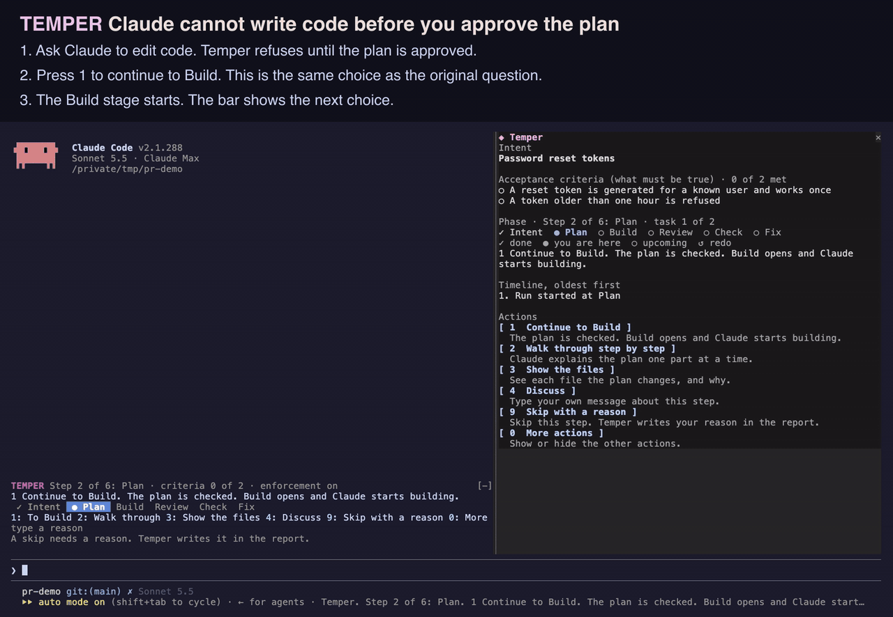
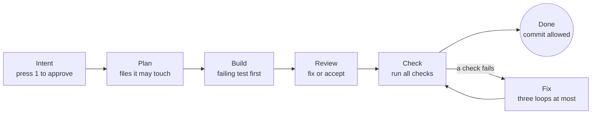
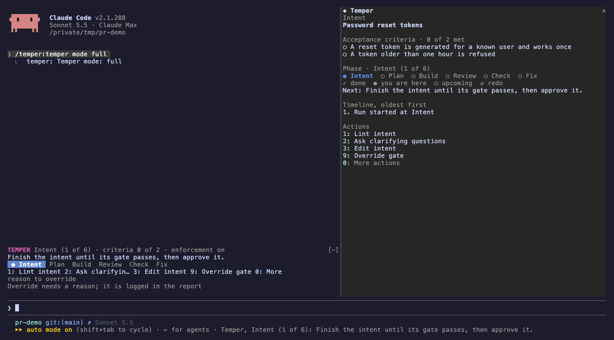
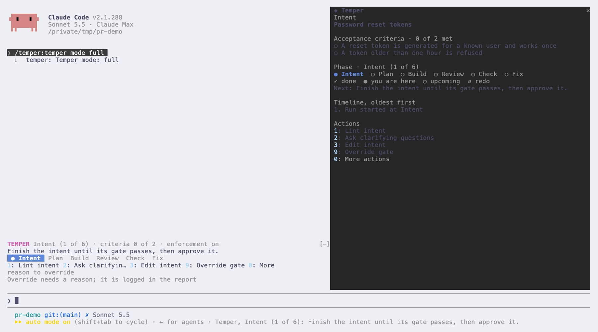
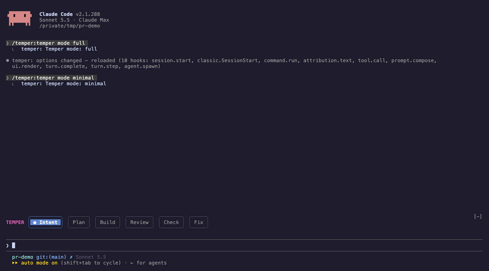
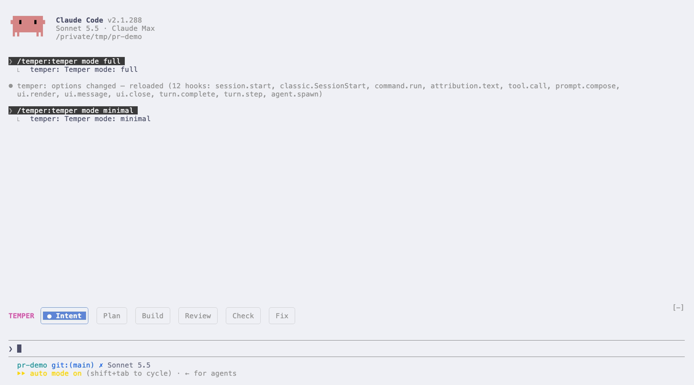
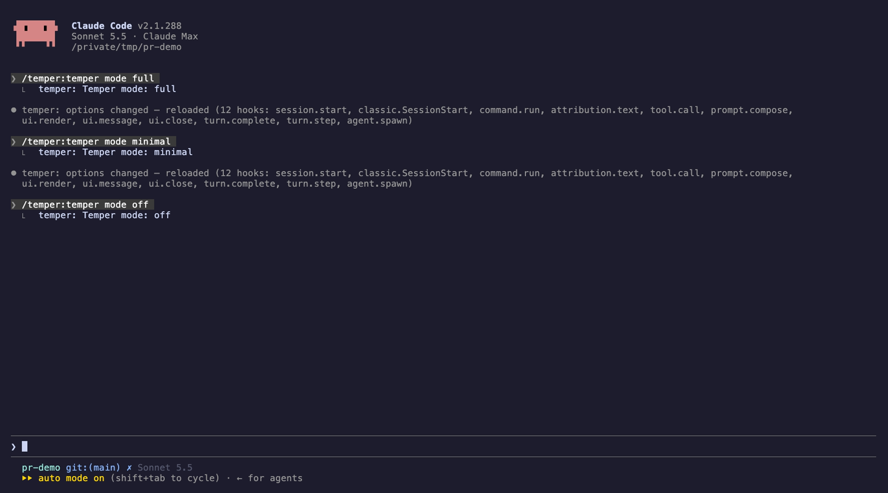
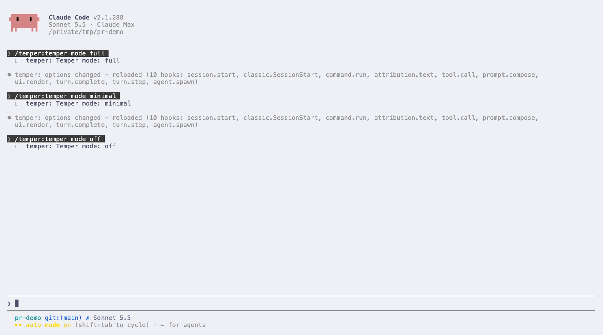
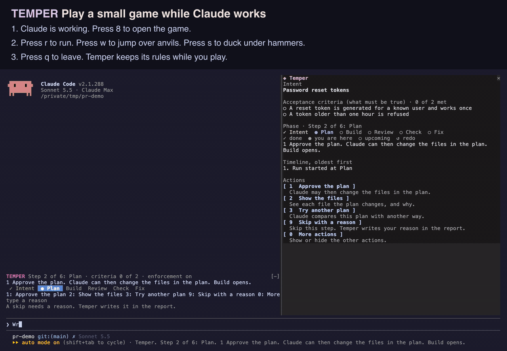

# Temper

**Claude cannot write code before you approve the intent.**

An intent gated workflow for AI generated code. Every gate verdict is computed by a small
CLI, never asserted by a model. With Claude Code 2.1.287 or later a mod refuses writes
outside the current phase through Claude's editing tools (details in "Where enforcement works").

[](https://code.claude.com/docs/en/discover-plugins)
[](https://github.com/galando/temper/releases)
[](#where-enforcement-works)
[](https://opensource.org/licenses/MIT)



[Website](https://galando.github.io/temper) · [Getting Started](docs/getting-started.md) · [Commands](docs/commands.md) · [Releases](https://github.com/galando/temper/releases)

## Install

```bash
/plugin marketplace add galando/temper
/plugin install temper
```

You can also open the Plugins page in Claude, choose **Discover** and search for "temper".

Your first `/temper "describe the feature"` sets the project up: the config, the `.temper/`
folder and a `pre-commit` hook that blocks `git commit` while any gate is red. The short form
`/temper` works only when no other plugin has the same command name; `/temper:temper` always
works. Use Claude Code 2.1.287 or later for the phase bar and the refusals below. Older versions
run every phase as prompts.

### Try the demo

From a clone of this repository, `bash demo/run-demo.sh` opens Claude Code on a small demo project
at "Step 2 of 6: Plan", with the plan ready. Ask Claude to change `src/users.js`: Temper refuses and
says what to do next. Then press `1` ("Continue to Build"): the bar moves to Build. Use
`bash demo/run-demo.sh intent` to start from the intent step. See [the demo script](docs/demo-script.md).

## The problem

AI writes code fast, with predictable failures: happy paths without edge cases, features
nobody asked for, calls to methods that do not exist, correct code that is never wired
in. Most tools check that the code compiles. Temper checks that it solves the right
problem, and it does so mechanically, not by asking the model to grade itself.

## How it works

One loop with a human gate at every stage. The cheapest artifact is reviewed first.
The order is Intent, Plan, Build, Review, Check, then Done. A failed check goes to Fix and back to Check.


```mermaid
flowchart LR
  I["Intent<br/>press 1 to approve"] --> P["Plan<br/>files it may touch"]
  P --> B["Build<br/>failing test first"]
  B --> R["Review<br/>fix or accept"]
  R --> C["Check<br/>run all checks"]
  C --> D(("Done<br/>commit allowed"))
  C -- "a check fails" --> F["Fix<br/>three loops at most"]
  F --> C
```

- **The intent gate comes first.** You approve the problem and the success criteria before
  exploration or architecture spends tokens. Correcting a wrong intent costs words here and
  costs the whole plan later.
- **Every gate is computed.** `scripts/temper` is auditable bash with no network. It reads an
  evidence ledger and prints PASS or FAIL per requirement. A red gate blocks `git commit`
  through a real hook. A person can override a gate (recorded with their identity). A
  confused model cannot.
- **The mod makes the phases real.** Claude Code 2.1.287 or later runs a small mod that
  refuses a write that does not belong to the current phase, refuses `git commit` until Check
  passes, draws the phase bar, and writes `.temper/report.md` at the end.

### One flow, two views

The Temper bar is the same choices as the questions Temper asks at each gate, without typing. With
the mod loaded, Temper does not ask the question twice: it prints the result of the stage and waits
for the bar, or for a message you type. The bar has only the options the original question had, with
its words, plus Discuss, Play and Skip with a reason. Anything else you can ask for by typing.

| Original option | Temper bar button |
|---|---|
| Continue to {next} | `1` Continue to {next} |
| Loop back to {upstream} | `1` Loop back to {upstream} (the check failed) |
| Override and continue | `9` Skip with a reason |
| Other (a change request) | `4` Discuss |
| Save for later | `0` More, Save for later (`2` at Done) |
| Grill Me | `2` or `3` (phase dependent), else `0` More |
| Teach Me | `3` (phase dependent), else `0` More |
| Walk through step by step | `2` at Plan |
| Open HTML review | `3` at Plan |
| Architecture Depth Review | `2` at Review |
| Review config suggestions | `2` at Check (when the file exists) |
| Change | `2` at a Build checkpoint |
| Stop | `3` at a Build checkpoint |
| Commit | `1` when the run is done |

Every original option is one digit away, or `0` and then a digit. Without the mod the questions
come back as they were.

### The three modes

You choose how much Temper draws with `/temper:temper mode`. Denials work in every mode.
Full draws the bar with action buttons, the pane, toasts and suggestions. Minimal draws the
phase bar only. Off draws nothing, and a write outside the phase is still refused.

| Dark | Light |
|---|---|
|  |  |
|  |  |
|  |  |

The rows are Full, Minimal and Off. The same mod runs in the desktop app (Code tab). A desktop
screenshot is not in the repository yet; [the demo script](docs/demo-script.md) says how to add one.

### Each phase

Key `1` is the main action and changes when the phase is ready to move on. Key `9` is override
everywhere and always asks for a reason. Key `0` shows every action.

| Phase | Writes allowed |
|---|---|
| Intent | `intent.md` only |
| Plan | `intent.md`, `plan.md`, `tasks.md`, `design.md` and new decision records |
| Build | The plan's files, test files and the spec folder. Other files raise scope drift. |
| Review | The spec folder only, unless a fix for that file is active |
| Check | The spec folder only. `git commit` stays refused until Check passes. |
| Fix | The failing files. After three failed loops Temper stops and offers Plan again, Override or Take over. |

The keys of each phase are in [Commands](docs/commands.md#each-phase).

### A game while you wait

Claude works and you wait? While a phase works, the band, the pane and the prompt hint offer
"Play while you wait". Press `8` at the empty prompt, or run `/temper:temper play`, to open Temper
Run. Ember, a small dragon, runs on the spot in a forge hall. Press `r` to run, `w` to jump over
anvils and buckets of cold water, and `s` to duck under flying hammers. The forge gets hotter as
your score grows. `q` or Esc leaves. You need no mouse. If no key reaches the game within 3 seconds,
it says "No keys yet? Press Ctrl+X, then Tab, to give the game the keys." and removes that line when a
key arrives. The game never opens by itself. It shows a banner when a phase is ready, so you do not
miss an approval, and refusals still apply while it is open. The plugin setting `game` has three
values: `on` (the offers and the command, the default), `command` (the command only) and `off`
(nothing).



The game runs on the terminal and the desktop app only. It was verified by hand on the
terminal, with the keyboard only. The image above is a placeholder until the recording from
`demo/game.tape` replaces it.

## Where enforcement works

The mod needs Claude Code 2.1.287 or later. This section says plainly where that is true,
where it is not, and what is unverified.

**Older versions.** Before 2.1.287 the plugin loads and works as it always did: prompt based phases,
the CLI gates and the native `pre-commit` hook. The mod is ignored or inert, and the skills say once
that enforcement is off. Checked on 2.1.200 and 2.1.259 (the plugin loads, the old hooks run). The plugin
settings declare no picker options on purpose: a settings field with options stops the whole
plugin loading on versions before 2.1.271.

| Surface | Refusals (hooks) | Drawing |
|---|---|---|
| `claude` in a terminal, including editor terminals | yes | yes |
| Desktop app, Code tab | yes | yes, except terminal only elements |
| Desktop app, WSL session | no (plugins are unavailable) | no |
| VS Code extension chat panel | yes | no |
| `claude -p` and the Agent SDK | yes | no |
| Remote Control (phone or web) | yes, on your machine | only in your machine's terminal |
| Cloud sessions (claude.ai/code) | yes, if the plugin reaches the session | no |
| claude.ai chat, Cowork | not documented, so unverified | not documented |
| GitHub Actions | not documented; it runs `claude -p`, so probably yes (unverified) | no |

Cloud sessions only receive plugins through server managed settings, so most people get the
prompt based phases there.

**Early access API.** Claude Code's mods API is early access and may change. The adapter in
`hooks/temper-mod/register.tsx` is deliberately thin, the rules are plain tested functions, and CI
runs the suite on Claude Code 2.1.287.

**Organization policy.** An administrator can switch parts of this off:

- `allowManagedModsOnly` is not a top level setting. It is an option of the built in
  `sec-default` guard. With it on, Temper's mod does not load unless the organization ships
  Temper itself. The rest of the plugin (commands, skills, agents, hooks) still loads.
- `allowManagedHooksOnly` also stops hooks from plugins, so the classic Temper hooks stop too
  unless the plugin is force enabled.
- `disableAllHooks` in managed settings stops every mod and every settings hook.
- A managed guard that runs first and denies a call wins, so two guards never conflict.
  Coexistence with the real `sec-default` was tested with a simulated prepended guard only,
  because loading the real one needs managed settings on the machine.

**You can turn it off.** Anyone can disable the plugin or run `/temper:temper enforcement off`. It guards
a workflow for honest use; it is not a security boundary.

**Bash is best effort.** The hard guarantee covers the tool layer: Write, Edit, NotebookEdit,
MultiEdit and `git commit`. For Bash the mod resolves variables in order, expands braces, follows
`cd`, and refuses a write it cannot check when the command names Temper state, so common tricks fail
closed. It cannot see a variable set in an earlier call or a profile, a Bash command can still write
ordinary source files, and MCP file tools are not covered. The native `pre-commit` hook is the
backstop. Button presses and the reason field carry no origin, so their authenticity rests on Claude Code.

**Limits you should know.** While a run is active, a Bash command that names the Temper script and
hides what it runs (`$(...)`, `${...}`, `$'...'`, a here-string, a script written and then run, a
launcher such as `env -S`, `make`, `awk` or `find -exec`) is refused. It is refused even when the
text does not show a decision word. Shell tricks that a text reader cannot see are still possible:
a link or a script made in an earlier call, or a script already on disk and run later with no name
in the command. So the hard guarantees are the editing tools and the native `pre-commit` hook, not
the Bash reader. The line `Temper enforcement: active` also appears in text files that Claude can
read. An injected copy can only hide a question, never advance a phase, because every advance still
needs the decision of the person or a passed check. When the run is Done, a model `git commit` is
allowed: the run is complete and the person pressed Continue. The Commit button is a prompt, not a
gate. A later version of the CLI could check a one time decision token itself.

**Without the mod** you keep the full pipeline: intent, plan, build, review and check as
prompts, every CLI gate verdict, the commit hook and the evidence ledger. You lose the live
refusals, the phase bar and the report.

## What the mod reads and writes

Mods are not sandboxed, so this is the full list. The mod uses no network and starts no process.

- **Reads:** files under `.temper/` (state, gates, evidence, intent, plan, tasks, config) and the
  event files of the current run. It also reads the plugin settings (`uiMode`, `enforcement`,
  `game` and a few more) and its own stored decisions.
- **Writes:** event files under `.temper/specs/<name>/events/` and `.temper/report.md`. It never
  edits your code. The game keeps one number, your best score, in the plugin store.
- **Asks:** you, with questions, for a mode, a scope drift choice, or a reason for an override.
- **Draws:** the phase bar, the pane and, if you open it, the game.
- **Tests, lint and git** run as prompts to Claude through Claude's normal tools and permissions.
  So do the `scripts/temper` calls that record your choices (Skip with a reason, Loop back, accept).
  In auto mode Claude Code's own permission check may refuse a skip, because it looks like a gate
  bypass. The bar then keeps your choice and says "Press 1 to record it". Allow the call once in your
  project settings, for example `Bash(*scripts/temper override*)`, or run it yourself with `!`.

CI fails if the mod gains any `process`, `http` or `env` call, or any call outside the reviewed list
in [scripts/check-mod-calls.sh](scripts/check-mod-calls.sh).

## Commands

Three you will actually type. `/temper` runs and routes the rest.

| Command | Purpose |
|---------|---------|
| [`/temper "..."`](docs/commands.md#temper-unified-command) | The whole pipeline, intent gate to commit |
| [`/temper:fix "..."`](docs/commands.md#temperfix) | Root cause, a failing test that is write protected, a minimal fix |
| [`/temper:intent "..."`](docs/commands.md#temperintent) | Capture an idea as a committed draft, build it later |

`/temper:temper` also takes subcommands such as `status`, `approve`, `override <reason>`, `back`,
`mode`, `pane` and `play`. See [Commands](docs/commands.md#subcommands).

**Granular control.** Each stage on its own: [`/temper:plan`](docs/commands.md#temperplan),
[`/temper:design`](docs/commands.md#temperdesign), [`/temper:build`](docs/commands.md#temperbuild),
[`/temper:review`](docs/commands.md#temperreview), [`/temper:check`](docs/commands.md#tempercheck).
Utilities: [`/temper:status`](docs/commands.md#temperstatus),
[`/temper:pack`](docs/commands.md#temperpack), [`/temper:init`](docs/commands.md#temperinit).

**Autonomy (opt in)** runs stages after the plan gate unattended and never commits, pushes or
merges. **Packs:** [docs/packs.md](docs/packs.md). **CI:** [examples/workflow/README.md](examples/workflow/README.md).

## Trust

Markdown, a mod written in TypeScript, and about 1,700 lines of auditable bash with small
inline Python for JSON parsing. Temper itself makes no network calls, sends no telemetry and
installs no packages. The committed artifacts (intent, plan, design, gate ledger, diff, and the
decision events and report from the mod) are the audit trail: who asked, what was planned, what
the gates verified, in the same commits as the code.

### What Temper runs and changes

Temper's scripts run locally with `bash`, `git` and `python3`, and write only inside your project.

- **Plugin hooks.** `hooks/hooks.json` registers two classic hooks and the mod module.
  `UserPromptSubmit` runs `scripts/hooks/stage-marker.sh`, which notes which gate a standalone
  stage command owes. `Stop` runs `scripts/hooks/verify-stage-gate.sh`, which can ask Claude to
  keep working (at most twice per stage) until that gate has a verdict. Both fail open.
- **Git hook.** On first run `scripts/hooks/install.sh` writes a `pre-commit` hook (secret scan and
  `temper gate commit`) into the active hooks folder, backing up any existing one. Delete it to remove it.
- **Your toolchain.** Build and check run the test, lint and type check commands your project
  already uses (`check.commands.*` in `.claude/temper.config`) and record their exit codes as evidence.
- **Optional tools you install yourself.** If `ocr` (open code review) is on your `PATH`,
  `/temper:review` runs it on the diff, and `ocr` sends that diff to the provider you set up.
  Set `tools.ocr.mode: off` to skip it. Temper never installs any tool, and
  `/temper:pack enable hooks` or autonomous continuation only run when you ask.

## Documentation

- [Getting Started](docs/getting-started.md) · [Commands](docs/commands.md) · [Packs](docs/packs.md)
- [Methodology](docs/methodology.md) · [Testing the mod](docs/mods-testing.md) · [Demo script](docs/demo-script.md) · [AI Native SDLC](docs/ai-native-sdlc.md)
- [Recommended Setup](docs/recommended-setup.md) · [Enterprise](docs/enterprise.md) · [Directory submission](docs/directory-submission.md) · [Privacy](https://galando.github.io/temper/privacy.html)

## Contributing and license

[CONTRIBUTING.md](CONTRIBUTING.md) · MIT © [Gal Naor](https://github.com/galando)
