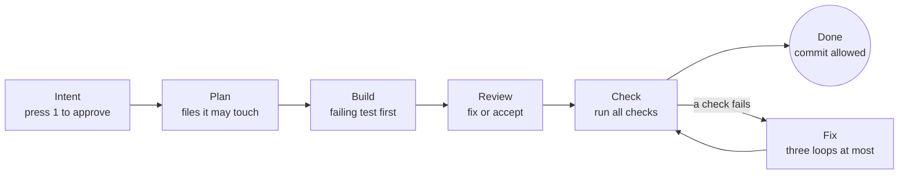

# Temper

**Claude cannot write code before you approve the intent.**

Temper is an intent gated workflow for code that AI writes. A small CLI computes each gate verdict.
The model never decides a verdict. With Claude Code 2.1.287 or later, a mod refuses writes outside
the current phase ([the mod](docs/mod.md)).

[](https://code.claude.com/docs/en/discover-plugins)
[](CHANGELOG.md)
[](docs/mod.md#where-enforcement-works)
[](https://opensource.org/licenses/MIT)

[](https://galando.github.io/temper/#video)

[Website](https://galando.github.io/temper) · [Getting Started](docs/getting-started.md) · [Commands](docs/commands.md) · [The mod](docs/mod.md) · [Releases](https://github.com/galando/temper/releases)

## Install

```text
/plugin marketplace add galando/temper
/plugin install temper
```

You can also open the Plugins page in Claude, choose **Discover** and search for "temper".

Your first `/temper:temper "describe the feature"` sets up the project. It adds the config, the
`.temper/` folder and a `pre-commit` hook. The hook blocks `git commit` while a gate is red.

The short form `/temper` is an interactive shortcut. It may not work on every surface. Claude Code
2.1.287 or later adds the phase bar and the refusals. Older versions run each phase as a prompt.

## The problem

AI writes code fast, but it fails in predictable ways:

- Happy paths without edge cases.
- Features that nobody asked for.
- Calls to methods that do not exist.
- Correct code that nothing uses.

Most tools check that the code compiles. Temper checks that the code solves the right problem. It does
this mechanically. It does not ask the model to grade itself.

## How it works

One loop, with a human gate at each stage. You review the cheapest artifact first.
The order is Intent, Plan, Build, Review, Check, then Done. A failed check goes to Fix and back to Check.


```mermaid
flowchart LR
  I["Intent<br/>press 1 to approve"] --> P["Plan<br/>files it may touch"]
  P --> B["Build<br/>failing test first"]
  B --> R["Review<br/>fix or accept"]
  R --> C["Check<br/>run all checks"]
  C --> D(("Done<br/>commit allowed"))
  C -- "a check fails" --> F["Fix<br/>three loops at most"]
  F --> C
```

- **The intent gate comes first.** You approve the problem and the success criteria before Claude
  explores or designs. A wrong intent costs words here. Later, it costs the whole plan.
- **Each gate is computed.** `scripts/temper` is auditable bash with no network. It reads an evidence
  ledger and prints PASS or FAIL for each requirement. A red gate blocks `git commit` through a real
  hook. A person can override a gate, and Temper records who did it. A confused model cannot.
- **The mod makes the phases real.** It refuses writes outside the phase, and `git commit` until Check
  passes. It draws the phase bar and keeps a report of the run. [The mod](docs/mod.md) has the details.

[](https://galando.github.io/temper/#mod)

## What the mod reads and writes

Mods are not sandboxed, so this is the full list. The mod makes no network, `process` or `env` call
and starts no agent. Its one tool call is Claude Code's question dialog (`$.ui.ask`, AskUserQuestion),
to ask you for a mode or a reason. CI fails on a call outside `scripts/check-mod-calls.sh`.

- **Reads:** `.claude/temper.config`; the run files in `.temper/` (`build-state.json`, `gates.json`, `status.json`,
  `overrides.json`, `feedback-loops.json`, `evidence/`, and a `report.md` an older Temper wrote); the spec folder of the run (`intent.md`, `plan.md`,
  `tasks.md`, `design.md`, `events/`, `config-suggestions.json`); and `.git/HEAD`. To find the project it stats the
  session folder and looks for `.temper/build-state.json` there and in up to 11 folders above it. It reads its
  settings, store and state and the Claude Code version. When you change the mode or enforcement it reads the
  `/config` list (every row) to find its two rows and whether your organization locked them. When `reviewerModel` is
  set it reads the session's agent list and keeps only the id and type, to find the Temper review agent.
- **Writes no file itself.** Decisions, run events, the report, the game's best score and whether you
  were asked for a mode stay in its plugin store, a JSON file in your Claude Code settings folder.
- **Session state:** for its drawing it keeps the bar's view (run title, phase, criteria, findings),
  the mode, the project folder and the game's key counts in `$.state`, which other plugins can read.
- **Configuration and environment it sets:** no environment variable. Only `temper.uiMode` (you type
  `/temper:temper mode`, or answer the mode question your first `/temper:temper` or a bare `mode` asks)
  and `temper.enforcement` (you type `/temper:temper enforcement`). A row your organization locked stays.
- **Slash commands it runs, and when:** only `/temper:temper` and `/temper:temper continue <stage>`
  (intent, plan, design, build, review or check), each written as fixed text, and only when you press a
  button or Enter in the reason field. No command is built from data.
- **What it puts in the prompts it submits:** only on that press, the fixed text of the action, with the phase, a
  finding number, your reason, and the plugin folder's path wherever the text names a Temper file (the
  `scripts/temper` command that records your choice, the Stop and Commit steps, the plan review files). Discuss and
  Change put a fixed draft in your prompt box. After an answer in full mode it may suggest the next fixed prompt; it
  never sends one. Each prompt is a turn of your session, marked as from the Temper plugin. Apart from these, the
  refusals below and its state, it sends no text out.
- **System prompt:** `prompt.compose` adds one section, `temper:phase`, to each request: enforcement on
  or off, the phase (and whether paused), task, run title, passed criteria, stale phases, the next
  step, a warning when its state and the CLI's disagree, and one fixed line (answer a message at a
  gate; after a requested change, run the gate again).
- **Hooks:**
  - `tool.call` sees every tool call, a subagent's too. It reads the path of Write, Edit, MultiEdit and NotebookEdit
    and the text of Bash, then refuses the call with a fixed reason and next step for Claude (a next step that runs
    `scripts/temper` gives the plugin folder's path), or passes it on and returns its result unchanged; it never
    answers for a tool. A write outside the plan is refused until you answer Claude's Scope drift question (why, the
    change, then Add to plan, Revert or Allow once); the mod records your answer from the dialog's result only.
  - `command.run` handles only `/temper:temper`. It answers `status`, `timeline`, `help`, `report`, `mode`,
    `enforcement`, `pane`, `play`, `pause` and `resume`. It records an accepted decision (`approve`, `next`, `back`,
    `override`, `accept`, `drift`) and passes it on; a refused one is answered with the reason. A word that changes
    state, and `play`, is refused unless you typed it in your prompt box; with enforcement off, a decision from any
    origin is accepted and its origin recorded. A bare `/temper:temper` you type toggles the pane in full mode during
    a phase. `pr`, `discuss`, `continue` and any other word or command pass on unchanged, even the two the mod runs.
  - `session.start` and `classic.SessionStart` find the project root and load the run; in full mode
    `session.start` also opens the pane during a phase. Both return what the engine gives them: no
    context, instruction or setting is added.
  - `turn.step` sets the model and effort from `phaseModels` and the Temper review agent's model from `reviewerModel`;
    empty options change nothing. `attribution.text` adds one Temper line to a pull request description during a run
    when `prAttribution` is on. `turn.complete` adds a one line status under an answer in full mode.
  - `ui.render` draws the bar, pane, game, spinner word, prompt hint and a line above Claude's question
    dialog, which stays unchanged. `ui.message` takes the game's score; `ui.close` notes a closed pane.
- **The game** is the mod's one surface module (the game client, with its runner, art and palette
  files), named as fixed text and imported statically. It makes no engine call and posts only the score.
- **Other:** key `9` moves the keys to the reason field. Toasts tell a phase change (full mode), an enforcement
  change, the default mode when you dismiss the mode question, and the result of a press. It waits 60 ms
  (`$.clock.sleep`, at most 4 times) to reread.
- **The tests never run in your session.** The mod's test suite runs only under `claude plugin test`; the plugin never
  loads it. Every `$` call there (`$.session.start`, `$.ui.mount`, `$.tool.call`, `$.agent.spawn` and the rest) goes
  to Claude Code's own test kit (`claude-code/testing`), not another plugin. Tests hand Bash, Write, Edit,
  NotebookEdit and Read calls to the guard. Temper's fake engine answers each tool call, question, prompt,
  `config.set`, `fs.write` and `command.run` with a stub and keeps what the mod sent in memory for the test to check,
  so nothing runs and nothing leaves the test. One test spawns a stub review agent (prompt `review it`, type
  `temper:temper-review`, no model); a stub answers it, so no agent runs, and the mod leaves the spawn unchanged.
- **Tests, lint, git and `scripts/temper`** run as prompts to Claude with its normal permissions. Auto
  mode may refuse a skip as a gate bypass; the bar then says "Press 1 to record it". Allow that one
  `scripts/temper override` command, or run it yourself with `!`.

## Commands

Three you will actually type. `/temper:temper` runs and routes the rest.

| Command | Purpose |
|---------|---------|
| [`/temper:temper "..."`](docs/commands.md#temper-unified-command) | The whole pipeline, intent gate to commit |
| [`/temper:fix "..."`](docs/commands.md#temperfix) | Root cause, a failing test that is write protected, a minimal fix |
| [`/temper:intent "..."`](docs/commands.md#temperintent) | Capture an idea as a committed draft, build it later |

`/temper:temper` also takes subcommands such as `status`, `approve`, `override <reason>`, `back`,
`mode`, `pane` and `play`. See [Commands](docs/commands.md#subcommands).

**Granular control.** Each stage on its own: [`/temper:plan`](docs/commands.md#temperplan),
[`/temper:design`](docs/commands.md#temperdesign), [`/temper:build`](docs/commands.md#temperbuild),
[`/temper:review`](docs/commands.md#temperreview), [`/temper:check`](docs/commands.md#tempercheck). Utilities:
[`/temper:status`](docs/commands.md#temperstatus), [`/temper:pack`](docs/commands.md#temperpack), [`/temper:init`](docs/commands.md#temperinit).

**Autonomy (opt in)** runs stages after the plan gate unattended and never commits, pushes or
merges. **Packs:** [docs/packs.md](docs/packs.md). **CI:** [examples/workflow/README.md](examples/workflow/README.md).

## Trust

Markdown, a mod written in TypeScript, about 4,400 lines of auditable bash (the CLI and the guard scripts) whose
inline Python parses and writes JSON and computes the gate requirements, and four Python scripts (about 1,000
lines, standard library only). Temper itself makes no network calls, sends no telemetry and adds no packages. The
committed artifacts (intent, plan, design, gate ledger and diff) are the audit trail, in the same commits as the code.

### What Temper runs and changes

Temper's scripts run locally with `bash`, `git` and `python3`, and write only inside your project and its git
folder. Apart from the mod's plugin store, Temper reads only one place in your home folder: its global pack
folder `~/.claude/packs`, if you made one. A pack's link targets come from the skills and commands your session lists.

- **Plugin hooks.** The plugin's hooks file registers two classic hooks and the mod module.
  `UserPromptSubmit` runs `scripts/guards/stage-marker.sh`, which notes which gate a standalone
  stage command owes. `Stop` runs `scripts/guards/verify-stage-gate.sh`, which can ask Claude to
  keep working (at most twice per stage) until that gate has a verdict. Both fail open.
- **Git hook.** On the first run `scripts/guards/install.sh` writes a `pre-commit` hook (a secret scan of the staged
  files, then `temper gate commit`) to `temper-gate/pre-commit` in the repository's git folder and points
  `core.hooksPath` at that folder, so every worktree runs it. It never writes into a folder named `hooks`. When git
  would stop running other hooks (in `.git/hooks`, Temper's older folder, or husky's or lefthook's folder), it leaves
  that setting and prints a path-free line for your hook, with a hint; 9.6.5's line still counts. After a move of the
  repository, the next `/temper` points the setting at the new place. Unset it before adding the pre-commit framework
  or lefthook. To remove, unset it, drop any Temper line, delete `temper-gate` and any 9.6.5 `temper-pre-commit`.
- **Your toolchain.** Build and check run the test, lint and type check commands of your stack (detected,
  or set in `check.commands.*` in `.claude/temper.config`) and record their exit codes as evidence.
- **Optional tools already on your machine.** OCR (open code review) is off by default. With `tools.ocr.mode`
  set to `auto` or `require` and `ocr` on your `PATH`, `/temper:review` uses it, and `ocr` sends the diff to
  the provider you set up. Temper adds no tool; the guardrails pack and autonomy run only when you ask.
- **Guardrails pack (opt in).** `/temper:pack enable guardrails` asks for the project's `.claude/settings.json`
  or `.claude/settings.local.json`, shows the change and, once you confirm, adds the guard hooks with the plugin
  folder's absolute path written in; `/temper:pack disable guardrails` removes them. `/temper:pack` and
  `/temper:init` offer to fix a guard path that no longer exists. They never touch the settings in your home folder.
- **Sharing a plan.** Share HTML review publishes the plan review only as a Claude artifact, after you confirm.

## Documentation, contributing and license

- [Getting Started](docs/getting-started.md) · [Commands](docs/commands.md) · [The mod](docs/mod.md) · [Packs](docs/packs.md)
- [Methodology](docs/methodology.md) · [Testing the mod](docs/mods-testing.md) · [AI Native SDLC](docs/ai-native-sdlc.md)
- [Recommended Setup](docs/recommended-setup.md) · [Enterprise](docs/enterprise.md) · [Directory submission](docs/directory-submission.md) · [Privacy](https://galando.github.io/temper/privacy.html)
- [CONTRIBUTING.md](CONTRIBUTING.md) · MIT © [Gal Naor](https://github.com/galando)
