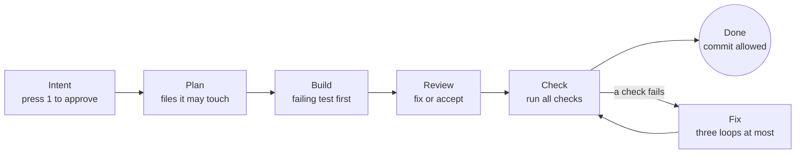

# Temper

**Claude cannot write code before you approve the intent.**

An intent gated workflow for AI generated code. Every gate verdict is computed by a small
CLI, never asserted by a model. With Claude Code 2.1.287 or later a mod refuses writes
outside the current phase through Claude's editing tools (details in "Where enforcement works").

[](https://code.claude.com/docs/en/discover-plugins)
[](https://github.com/galando/temper/releases)
[](#where-enforcement-works)
[](https://opensource.org/licenses/MIT)


[Website](https://galando.github.io/temper) · [Getting Started](docs/getting-started.md) · [Commands](docs/commands.md) · [Releases](https://github.com/galando/temper/releases)

## Install

```bash
/plugin marketplace add galando/temper
/plugin install temper
```

Your first `/temper "describe the feature"` sets the project up: the config, the `.temper/`
folder and a `pre-commit` hook that blocks `git commit` while any gate is red. The short form
`/temper` works only when no other plugin has the same command name; `/temper:temper` always
works. Use Claude Code 2.1.287 or later for the phase bar and the refusals below. Older versions
run every phase as prompts.

## The problem

AI writes code fast, with predictable failures: happy paths without edge cases, features
nobody asked for, calls to methods that do not exist, correct code that is never wired
in. Most tools check that the code compiles. Temper checks that it solves the right
problem, and it does so mechanically, not by asking the model to grade itself.

## How it works

One loop with a human gate at every stage. The cheapest artifact is reviewed first.


```mermaid
flowchart LR
  I["Intent<br/>press 1 to approve"] --> P["Plan<br/>files it may touch"]
  P --> B["Build<br/>failing test first"]
  B --> R["Review<br/>fix or accept"]
  R --> C["Check<br/>run all checks"]
  C --> D(("Done<br/>commit allowed"))
  C -- "a check fails" --> F["Fix<br/>three loops at most"]
  F --> C
```

- **The intent gate comes first.** You approve the problem and the success criteria before
  exploration or architecture spends tokens. Correcting a wrong intent costs words here and
  costs the whole plan later.
- **Every gate is computed.** `scripts/temper` is auditable bash with no network. It reads an
  evidence ledger and prints PASS or FAIL per requirement. A red gate blocks `git commit`
  through a real hook. A person can override a gate (recorded with their identity). A
  confused model cannot.
- **The mod makes the phases real.** Claude Code 2.1.287 or later runs a small mod that
  refuses a write that does not belong to the current phase, refuses `git commit` until Check
  passes, draws the phase bar, and writes `.temper/report.md` at the end.

### The three modes

You choose how much Temper draws with `/temper:temper mode`. Denials work in every mode.

<picture>
  <source media="(prefers-color-scheme: dark)" srcset="docs/assets/mode-full-dark.png">
  
</picture>
**Full** draws the bar with action buttons, the pane, toasts and suggestions.
<picture>
  <source media="(prefers-color-scheme: dark)" srcset="docs/assets/mode-minimal-dark.png">
  
</picture>
**Minimal** draws the phase bar only.
<picture>
  <source media="(prefers-color-scheme: dark)" srcset="docs/assets/mode-off-dark.png">
  
</picture>
**Off** draws nothing. A write outside the phase is still refused.
<picture>
  <source media="(prefers-color-scheme: dark)" srcset="docs/assets/desktop-dark.png">
  
</picture>
The same mod runs in the desktop app (Code tab).

### Each phase

Key `1` is the main action and changes when the phase is ready to move on. Key `9` is
override everywhere and always asks for a reason. Key `0` opens the pane with every action.

<details><summary><b>Intent</b>: write the problem and the criteria</summary>

| Key | Action |
|---|---|
| 1 | Approve intent (when the gate passes), otherwise Lint intent |
| 2, 3 | Ask clarifying questions, Edit intent |
| 0 | Capture intent from my prompt |

Allowed writes: the spec's `intent.md`. Everything else is refused.

</details>

<details><summary><b>Plan</b>: scenarios, blast radius, files</summary>

| Key | Action |
|---|---|
| 1 | Approve plan (when the gate passes), otherwise Generate plan |
| 2, 3 | Show files the plan touches, Propose an alternative |
| 0 | Split into tasks, Back to Intent |

Allowed writes: `intent.md`, `plan.md`, `tasks.md`, `design.md` and new decision records.

</details>

<details><summary><b>Build</b>: failing test first, inside the plan</summary>

| Key | Action |
|---|---|
| 1 | Start next task, or Send to Review when the tasks are done |
| 2, 3 | Run tests for the current criterion, Show diff against plan |
| 0 | Pause |

Allowed writes: the plan's files, test files and the spec folder. A write anywhere else raises
scope drift: add it to the plan, revert it, or allow it once with a reason. Each choice is logged.

</details>

<details><summary><b>Review</b>: confidence scored findings</summary>

| Key | Action |
|---|---|
| 1 | Start review, or Fix all when findings exist |
| 2 | `Re-review` |
| 3 | Show diff |
| pane | Per finding: Fix, Accept with reason, Explain |

Allowed writes: the spec folder only, unless a fix for that file is active.

</details>

<details><summary><b>Check</b>: stack validation</summary>

| Key | Action |
|---|---|
| 1 | Run all checks, or Mark done when every check passes |
| 2, 3 | Rerun failed only, Failures by criterion |

Allowed writes: the spec folder only. `git commit` stays refused until Check passes.

</details>

<details><summary><b>Fix</b>: the loop after a failed check</summary>

| Key | Action |
|---|---|
| 1, 2, 3 | Fix failures, Fix open findings, Return to Check |
| at the limit | `Re-plan`, Override, I take over |

After three failed loops (configurable with `fix.max-loops`) Temper stops and offers those three choices.

</details>

## Where enforcement works

The mod needs Claude Code 2.1.287 or later. This section says plainly where that is true,
where it is not, and what is unverified.

**Older versions.** Before 2.1.287 the plugin loads and works as it always did: prompt based phases,
the CLI gates and the native `pre-commit` hook. The mod is ignored or inert, and the skills say once
that enforcement is off. Checked on 2.1.200 and 2.1.259 (the plugin loads, the old hooks run). The plugin
settings declare no picker options on purpose: a settings field with options stops the whole
plugin loading on versions before 2.1.271.

| Surface | Refusals (hooks) | Drawing |
|---|---|---|
| `claude` in a terminal, including editor terminals | yes | yes |
| Desktop app, Code tab | yes | yes, except terminal only elements |
| Desktop app, WSL session | no (plugins are unavailable) | no |
| VS Code extension chat panel | yes | no |
| `claude -p` and the Agent SDK | yes | no |
| Remote Control (phone or web) | yes, on your machine | only in your machine's terminal |
| Cloud sessions (claude.ai/code) | yes, if the plugin reaches the session | no |
| claude.ai chat, Cowork | not documented, so unverified | not documented |
| GitHub Actions | not documented; it runs `claude -p`, so probably yes (unverified) | no |

Cloud sessions only receive plugins through server managed settings, so most people get the
prompt based phases there.

**Early access API.** Claude Code's mods API is early access and may change. The adapter in
`hooks/temper-mod/register.tsx` is deliberately thin, the rules are plain tested functions, and CI
runs the suite on Claude Code 2.1.287.

**Organization policy.** An administrator can switch parts of this off:

- `allowManagedModsOnly` is not a top level setting. It is an option of the built in
  `sec-default` guard. With it on, Temper's mod does not load unless the organization ships
  Temper itself. The rest of the plugin (commands, skills, agents, hooks) still loads.
- `allowManagedHooksOnly` also stops hooks from plugins, so the classic Temper hooks stop too
  unless the plugin is force enabled.
- `disableAllHooks` in managed settings stops every mod and every settings hook.
- A managed guard that runs first and denies a call wins, so two guards never conflict.
  Coexistence with the real `sec-default` was tested with a simulated prepended guard only,
  because loading the real one needs managed settings on the machine.

**You can turn it off.** Anyone can disable the plugin or run `/temper:temper enforcement off`. It guards
a workflow for honest use; it is not a security boundary.

**What the mod can do.** Mods are not sandboxed. This one uses no network and spawns no
process: it reads and writes files under `.temper/` and the project (events and the report),
asks you questions, and draws. Tests, lint and git run as prompts to Claude through Claude's
normal tools and permissions. CI fails if the mod gains any `process`, `http` or `env` call or
any call outside the reviewed list in [`scripts/check-mod-calls.sh`](scripts/check-mod-calls.sh).

**Bash is best effort.** The hard guarantee covers the tool layer: Write, Edit, NotebookEdit,
MultiEdit and `git commit`. Patterns catch common Bash writes to Temper's own state files
(through wrappers, redirects and quoting tricks), but a Bash command can write ordinary source
files, and MCP file tools are not covered. The
native `pre-commit` hook is a second layer that still blocks a commit with a red gate.

**Without the mod** you keep the full pipeline: intent, plan, build, review and check as
prompts, every CLI gate verdict, the commit hook and the evidence ledger. You lose the live
refusals, the phase bar and the report.

## Commands

Three you will actually type. `/temper` runs and routes the rest.

| Command | Purpose |
|---------|---------|
| [`/temper "..."`](docs/commands.md#temper-unified-command) | The whole pipeline, intent gate to commit |
| [`/temper:fix "..."`](docs/commands.md#temperfix) | Root cause, a failing test that is write protected, a minimal fix |
| [`/temper:intent "..."`](docs/commands.md#temperintent) | Capture an idea as a committed draft, build it later |

`/temper:temper` also takes subcommands such as `status`, `approve`, `override <reason>`, `back`,
`mode` and `pane`. See [Commands](docs/commands.md#subcommands).

<details><summary><b>Granular control</b>: each stage on its own, plus utilities</summary>

| Command | Purpose |
|---------|---------|
| [`/temper:plan`](docs/commands.md#temperplan) | Blast radius, BDD scenarios and architecture |
| [`/temper:design`](docs/commands.md#temperdesign) | System design, areas of concern gated |
| [`/temper:build`](docs/commands.md#temperbuild) | Scenario driven TDD and a coverage gate |
| [`/temper:review`](docs/commands.md#temperreview) | Confidence scored review and intent validation |
| [`/temper:check`](docs/commands.md#tempercheck) | Stack aware validation pipeline |
| [`/temper:status`](docs/commands.md#temperstatus) | Dashboard: gates, hotspots, control bands |
| [`/temper:pack`](docs/commands.md#temperpack) | Manage quality packs |
| [`/temper:init`](docs/commands.md#temperinit) | Explicit setup, safe to repeat |

</details>

**Autonomy (opt in)** runs stages after the plan gate unattended and never commits, pushes or
merges. **Packs:** [docs/packs.md](docs/packs.md). **CI:** [examples/workflow/README.md](examples/workflow/README.md).

## Trust

Markdown, a mod written in TypeScript, and about 1,700 lines of auditable bash with small
inline Python for JSON parsing. Temper itself makes no network calls, sends no telemetry and
installs no packages. The committed artifacts (intent, plan, design, gate ledger, diff, and the
decision events and report from the mod) are the audit trail: who asked, what was planned, what
the gates verified, in the same commits as the code.

### What Temper runs and changes

Temper's scripts run locally with `bash`, `git` and `python3`, and write only inside your project.

- **Plugin hooks.** `hooks/hooks.json` registers two classic hooks and the mod module.
  `UserPromptSubmit` runs `scripts/hooks/stage-marker.sh`, which notes which gate a standalone
  stage command owes. `Stop` runs `scripts/hooks/verify-stage-gate.sh`, which can ask Claude to
  keep working (at most twice per stage) until that gate has a verdict. Both fail open.
- **The mod.** It reads `.temper/` files and writes event files under `.temper/specs/<name>/events/`
  and `.temper/report.md`. It refuses writes by returning a reason, and never edits your code.
- **Git hook.** On first run `scripts/hooks/install.sh` writes a `pre-commit` hook (secret scan and
  `temper gate commit`) into the active hooks folder, backing up any existing one. Delete it to remove it.
- **Your toolchain.** Build and check run the test, lint and type check commands your project
  already uses (`check.commands.*` in `.claude/temper.config`) and record their exit codes as evidence.
- **Optional tools you install yourself.** If `ocr` (open code review) is on your `PATH`,
  `/temper:review` runs it on the diff, and `ocr` sends that diff to the provider you set up.
  Set `tools.ocr.mode: off` to skip it. Temper never installs any tool, and
  `/temper:pack enable hooks` or autonomous continuation only run when you ask.

## Documentation

- [Getting Started](docs/getting-started.md) · [Commands](docs/commands.md) · [Packs](docs/packs.md)
- [Methodology](docs/methodology.md) · [Testing the mod](docs/mods-testing.md) · [Demo script](docs/demo-script.md) · [AI Native SDLC](docs/ai-native-sdlc.md)
- [Recommended Setup](docs/recommended-setup.md) · [Enterprise](docs/enterprise.md) · [Privacy](https://galando.github.io/temper/privacy.html)

## Contributing and license

[CONTRIBUTING.md](CONTRIBUTING.md) · MIT © [Gal Naor](https://github.com/galando)
