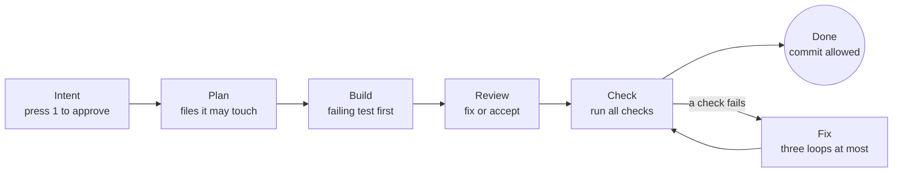

# Temper

**Claude cannot write code before you approve the intent.**

Temper is an intent gated workflow for code that AI writes. A small CLI computes each gate verdict.
The model never decides a verdict. With Claude Code 2.1.287 or later, a mod refuses writes outside
the current phase ([the mod](docs/mod.md)).

[](https://code.claude.com/docs/en/discover-plugins)
[](CHANGELOG.md)
[](docs/mod.md#where-enforcement-works)
[](https://opensource.org/licenses/MIT)

https://github.com/user-attachments/assets/ad593a29-a75d-407b-8945-94aa93e8439d

[Website](https://galando.github.io/temper) · [Getting Started](docs/getting-started.md) · [Commands](docs/commands.md) · [The mod](docs/mod.md) · [Releases](https://github.com/galando/temper/releases)

## Install

```text
/plugin marketplace add galando/temper
/plugin install temper
```

You can also open the Plugins page in Claude, choose **Discover** and search for "temper".

Your first `/temper:temper "describe the feature"` sets up the project. It adds the config, the
`.temper/` folder and a `pre-commit` hook. The hook blocks `git commit` while a gate is red.

The short form `/temper` is an interactive shortcut. It may not work on every surface. Claude Code
2.1.287 or later adds the phase bar and the refusals. Older versions run each phase as a prompt.

## The problem

AI writes code fast, but it fails in predictable ways:

- Happy paths without edge cases.
- Features that nobody asked for.
- Calls to methods that do not exist.
- Correct code that nothing uses.

Most tools check that the code compiles. Temper checks that the code solves the right problem. It does
this mechanically. It does not ask the model to grade itself.

## How it works

One loop, with a human gate at each stage. You review the cheapest artifact first.
The order is Intent, Plan, Build, Review, Check, then Done. A failed check goes to Fix and back to Check.


```mermaid
flowchart LR
  I["Intent<br/>press 1 to approve"] --> P["Plan<br/>files it may touch"]
  P --> B["Build<br/>failing test first"]
  B --> R["Review<br/>fix or accept"]
  R --> C["Check<br/>run all checks"]
  C --> D(("Done<br/>commit allowed"))
  C -- "a check fails" --> F["Fix<br/>three loops at most"]
  F --> C
```

- **The intent gate comes first.** You approve the problem and the success criteria before Claude
  explores or designs. A wrong intent costs words here. Later, it costs the whole plan.
- **Each gate is computed.** `scripts/temper` is auditable bash with no network. It reads an evidence
  ledger and prints PASS or FAIL for each requirement. A red gate blocks `git commit` through a real
  hook. A person can override a gate, and Temper records who did it. A confused model cannot.
- **The mod makes the phases real.** It refuses writes outside the phase, and `git commit` until Check
  passes. It draws the phase bar and keeps a report of the run. [The mod](docs/mod.md) has the details.

https://github.com/user-attachments/assets/627e1385-cbc0-4ad9-bd3a-05ca2b8bb09e

## What the mod reads and writes

The mod makes no network, `process` or `env` call, starts no agent and writes no file itself. The full list
of what it reads, writes, sets and runs is in [The mod](docs/mod.md#what-the-mod-reads-and-writes).

## Commands

Three you will actually type. `/temper:temper` runs and routes the rest.

| Command | Purpose |
|---------|---------|
| [`/temper:temper "..."`](docs/commands.md#temper-unified-command) | The whole pipeline, intent gate to commit |
| [`/temper:fix "..."`](docs/commands.md#temperfix) | Root cause, a failing test that is write protected, a minimal fix |
| [`/temper:intent "..."`](docs/commands.md#temperintent) | Capture an idea as a committed draft, build it later |

`/temper:temper` also takes subcommands such as `status`, `approve`, `override <reason>`, `back`,
`mode`, `pane` and `play`. See [Commands](docs/commands.md#subcommands).

**Granular control.** Each stage on its own: [`/temper:plan`](docs/commands.md#temperplan),
[`/temper:design`](docs/commands.md#temperdesign), [`/temper:build`](docs/commands.md#temperbuild),
[`/temper:review`](docs/commands.md#temperreview), [`/temper:check`](docs/commands.md#tempercheck). Utilities:
[`/temper:status`](docs/commands.md#temperstatus), [`/temper:pack`](docs/commands.md#temperpack), [`/temper:init`](docs/commands.md#temperinit).

**Autonomy (opt in)** runs stages after the plan gate unattended and never commits, pushes or
merges. **Packs:** [docs/packs.md](docs/packs.md). **CI:** [examples/workflow/README.md](examples/workflow/README.md).

## Documentation, contributing and license

- [Getting Started](docs/getting-started.md) · [Commands](docs/commands.md) · [The mod](docs/mod.md) · [Trust](docs/trust.md) · [Packs](docs/packs.md)
- [Methodology](docs/methodology.md) · [Testing the mod](docs/mods-testing.md) · [AI Native SDLC](docs/ai-native-sdlc.md)
- [Recommended Setup](docs/recommended-setup.md) · [Enterprise](docs/enterprise.md) · [Directory submission](docs/directory-submission.md) · [Privacy](https://galando.github.io/temper/privacy.html)
- [CONTRIBUTING.md](CONTRIBUTING.md) · MIT © [Gal Naor](https://github.com/galando)
